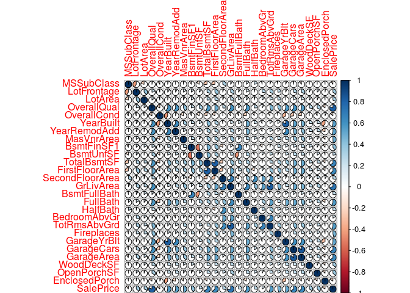
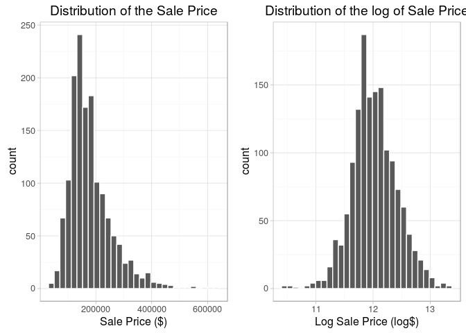
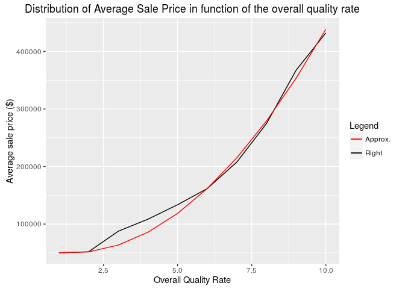
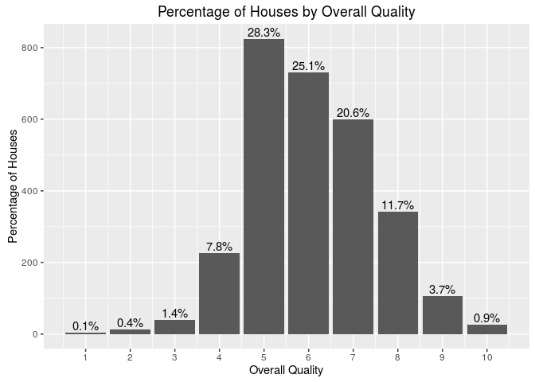

# House Prices
Gabriel Lapointe  
September 18, 2016  


# Data Acquisition
In this section, we specify the business problem to solve for this project. From the data source, we will ask questions on the dataset and establish a methodology to solve the problem.


## Objective
With 79 explanatory variables describing (almost) every aspect of residential homes in Ames, Iowa, we have to predict the final price of each home.


## Data Source
The data is provided by Kaggle at https://www.kaggle.com/c/house-prices-advanced-regression-techniques/data. 


## Dataset Questions
Before we start the exploration of the dataset, we need to write a list of questions about this dataset considering the problem we have to solve. 

* How big is the dataset?
* Does the dataset contains `NA` or missing values? Can we replace them by a value? Why?
* Does the data is coherent (date with same format, no out of bound values, no misspelled words, etc.)?
* What does the data look like and what are the relationships between features if they exist?
* What are the measures used?
* Does the dataset contains abnormal data?
* Can we solve the problem with this dataset?


## Evaluation Metrics
Submissions are evaluated on Root-Mean-Squared-Error (RMSE) between the logarithm of the predicted value and the logarithm of the observed sales price. (Taking logs means that errors in predicting expensive houses and cheap houses will affect the result equally.)


## Methodology
In this document, we start by exploring the dataset and build the data story behind it. This will give us important insights which will answer our questions on this dataset. The next step is to proceed to feature engineering which consists to create, remove or replace features regarding insights we got when exploring the dataset. Then, we will peoceed to a features selection to know which features are strongly correlated to the outcome. We will ensure our new dataset is a valid input for each of our prediction models. We will fine-tune the model's parameters by cross-validating the model with the train set to get the optimal parameters. After applying our model to the test set, we will visualize the predictions calculated and explain the results. Finally, we will give our recommandations to fulfill the objective of this project.


## Loading Dataset
We load 'train.csv' and 'test.csv'. Then, we merge them to proceed to the cleaning and exploration of the entire dataset.


```r
library(data.table)
library(dplyr)
library(scales)
library(gridExtra)
library(ggplot2)
library(caret)
library(corrplot)
library(Matrix)
library(randomForest)
library(xgboost)

setwd("/home/gabriel/Documents/Projects/HousePrices")

## Remove scientific notation (e.g. E-005).
options(scipen = 999)

set.seed(1234)

na.strings <- c("NA", "None")
train <- fread(input = "train.csv", 
               showProgress = FALSE,
               stringsAsFactors = FALSE, 
               na.strings = na.strings, 
               header = TRUE)

test <- fread(input = "test.csv", 
              showProgress = FALSE,
              stringsAsFactors = FALSE, 
              na.strings = na.strings, 
              header = TRUE)

test$SalePrice <- -1
dataset <- rbind(train, test)
```

| Dataset            |  File Size (Kb) | # Houses              | # Features            |
| ------------------ | --------------- | --------------------- | --------------------- |
| train.csv          | 460.7           | 1460       | 81       |
| test.csv           | 451.4           | 1459        | 80    |
| **Total(dataset)** | **912.1**       | **2919** | **81** |

These datasets are very small. Each observation (row) is a house where we want to predict their sale price in the test set.


<!------------------------------------------------------------DATASET CLEANING------------------------------------------------------------------------------>


# Dataset Cleaning
In this section, we have to check if the dataset is valid with the possible values given in the code book. Thus, we need to ensure that there are no mispelled words or no values that are not in the code book. Also, all numerical values should be coherent with their description meaning that their bounds have to be logically correct. Regarding the code book, none of the categorical features have over 25 unique values. We then display the unique values of these categorical features. Then, we will compare the values mentioned in the code book with the values we have in the dataset.


```r
getUniqueValues <- function(feature)
{
    feature.values <- unique(feature)
    if(length(feature.values) <= 25)
    {
        paste(sort(feature.values, na.last = TRUE), collapse = ", ")
    }
}

sapply(dataset, getUniqueValues)
```

```
## $Id
## NULL
## 
## $MSSubClass
## [1] "20, 30, 40, 45, 50, 60, 70, 75, 80, 85, 90, 120, 150, 160, 180, 190"
## 
## $MSZoning
## [1] "C (all), FV, RH, RL, RM, NA"
## 
## $LotFrontage
## NULL
## 
## $LotArea
## NULL
## 
## $Street
## [1] "Grvl, Pave"
## 
## $Alley
## [1] ", Grvl, Pave, NA"
## 
## $LotShape
## [1] "IR1, IR2, IR3, Reg"
## 
## $LandContour
## [1] "Bnk, HLS, Low, Lvl"
## 
## $Utilities
## [1] "AllPub, NoSeWa, NA"
## 
## $LotConfig
## [1] "Corner, CulDSac, FR2, FR3, Inside"
## 
## $LandSlope
## [1] "Gtl, Mod, Sev"
## 
## $Neighborhood
## [1] "Blmngtn, Blueste, BrDale, BrkSide, ClearCr, CollgCr, Crawfor, Edwards, Gilbert, IDOTRR, MeadowV, Mitchel, NAmes, NoRidge, NPkVill, NridgHt, NWAmes, OldTown, Sawyer, SawyerW, Somerst, StoneBr, SWISU, Timber, Veenker"
## 
## $Condition1
## [1] "Artery, Feedr, Norm, PosA, PosN, RRAe, RRAn, RRNe, RRNn"
## 
## $Condition2
## [1] "Artery, Feedr, Norm, PosA, PosN, RRAe, RRAn, RRNn"
## 
## $BldgType
## [1] "1Fam, 2fmCon, Duplex, Twnhs, TwnhsE"
## 
## $HouseStyle
## [1] "1.5Fin, 1.5Unf, 1Story, 2.5Fin, 2.5Unf, 2Story, SFoyer, SLvl"
## 
## $OverallQual
## [1] "1, 2, 3, 4, 5, 6, 7, 8, 9, 10"
## 
## $OverallCond
## [1] "1, 2, 3, 4, 5, 6, 7, 8, 9"
## 
## $YearBuilt
## NULL
## 
## $YearRemodAdd
## NULL
## 
## $RoofStyle
## [1] "Flat, Gable, Gambrel, Hip, Mansard, Shed"
## 
## $RoofMatl
## [1] "ClyTile, CompShg, Membran, Metal, Roll, Tar&Grv, WdShake, WdShngl"
## 
## $Exterior1st
## [1] "AsbShng, AsphShn, BrkComm, BrkFace, CBlock, CemntBd, HdBoard, ImStucc, MetalSd, Plywood, Stone, Stucco, VinylSd, Wd Sdng, WdShing, NA"
## 
## $Exterior2nd
## [1] "AsbShng, AsphShn, Brk Cmn, BrkFace, CBlock, CmentBd, HdBoard, ImStucc, MetalSd, Other, Plywood, Stone, Stucco, VinylSd, Wd Sdng, Wd Shng, NA"
## 
## $MasVnrType
## [1] "BrkCmn, BrkFace, Stone, NA"
## 
## $MasVnrArea
## NULL
## 
## $ExterQual
## [1] "Ex, Fa, Gd, TA"
## 
## $ExterCond
## [1] "Ex, Fa, Gd, Po, TA"
## 
## $Foundation
## [1] "BrkTil, CBlock, PConc, Slab, Stone, Wood"
## 
## $BsmtQual
## [1] "Ex, Fa, Gd, TA, NA"
## 
## $BsmtCond
## [1] "Fa, Gd, Po, TA, NA"
## 
## $BsmtExposure
## [1] "Av, Gd, Mn, No, NA"
## 
## $BsmtFinType1
## [1] "ALQ, BLQ, GLQ, LwQ, Rec, Unf, NA"
## 
## $BsmtFinSF1
## NULL
## 
## $BsmtFinType2
## [1] "ALQ, BLQ, GLQ, LwQ, Rec, Unf, NA"
## 
## $BsmtFinSF2
## NULL
## 
## $BsmtUnfSF
## NULL
## 
## $TotalBsmtSF
## NULL
## 
## $Heating
## [1] "Floor, GasA, GasW, Grav, OthW, Wall"
## 
## $HeatingQC
## [1] "Ex, Fa, Gd, Po, TA"
## 
## $CentralAir
## [1] "N, Y"
## 
## $Electrical
## [1] "FuseA, FuseF, FuseP, Mix, SBrkr, NA"
## 
## $`1stFlrSF`
## NULL
## 
## $`2ndFlrSF`
## NULL
## 
## $LowQualFinSF
## NULL
## 
## $GrLivArea
## NULL
## 
## $BsmtFullBath
## [1] "0, 1, 2, 3, NA"
## 
## $BsmtHalfBath
## [1] "0, 1, 2, NA"
## 
## $FullBath
## [1] "0, 1, 2, 3, 4"
## 
## $HalfBath
## [1] "0, 1, 2"
## 
## $BedroomAbvGr
## [1] "0, 1, 2, 3, 4, 5, 6, 8"
## 
## $KitchenAbvGr
## [1] "0, 1, 2, 3"
## 
## $KitchenQual
## [1] "Ex, Fa, Gd, TA, NA"
## 
## $TotRmsAbvGrd
## [1] "2, 3, 4, 5, 6, 7, 8, 9, 10, 11, 12, 13, 14, 15"
## 
## $Functional
## [1] "Maj1, Maj2, Min1, Min2, Mod, Sev, Typ, NA"
## 
## $Fireplaces
## [1] "0, 1, 2, 3, 4"
## 
## $FireplaceQu
## [1] "Ex, Fa, Gd, Po, TA, NA"
## 
## $GarageType
## [1] "2Types, Attchd, Basment, BuiltIn, CarPort, Detchd, NA"
## 
## $GarageYrBlt
## NULL
## 
## $GarageFinish
## [1] "Fin, RFn, Unf, NA"
## 
## $GarageCars
## [1] "0, 1, 2, 3, 4, 5, NA"
## 
## $GarageArea
## NULL
## 
## $GarageQual
## [1] "Ex, Fa, Gd, Po, TA, NA"
## 
## $GarageCond
## [1] "Ex, Fa, Gd, Po, TA, NA"
## 
## $PavedDrive
## [1] "N, P, Y"
## 
## $WoodDeckSF
## NULL
## 
## $OpenPorchSF
## NULL
## 
## $EnclosedPorch
## NULL
## 
## $`3SsnPorch`
## NULL
## 
## $ScreenPorch
## NULL
## 
## $PoolArea
## [1] "0, 144, 228, 368, 444, 480, 512, 519, 555, 561, 576, 648, 738, 800"
## 
## $PoolQC
## [1] ", Ex, Fa, Gd, NA"
## 
## $Fence
## [1] "GdPrv, GdWo, MnPrv, MnWw, NA"
## 
## $MiscFeature
## [1] ", Gar2, Othr, Shed, TenC, NA"
## 
## $MiscVal
## NULL
## 
## $MoSold
## [1] "1, 2, 3, 4, 5, 6, 7, 8, 9, 10, 11, 12"
## 
## $YrSold
## [1] "2006, 2007, 2008, 2009, 2010"
## 
## $SaleType
## [1] "COD, Con, ConLD, ConLI, ConLw, CWD, New, Oth, WD, NA"
## 
## $SaleCondition
## [1] "Abnorml, AdjLand, Alloca, Family, Normal, Partial"
## 
## $SalePrice
## NULL
```


## Feature Names Harmonization
We need to harmonize the feature names to be coherent with the code book. Comparing with the code book's possible codes manually, the followings have difference:

| Feature            | Dataset      | CodeBook        |
| ------------------ | ------------ | --------------- |
| MSZoning           | C (all)      | C |
| MSZoning           | NA           | No corresponding value |
| Alley              | Empty string | No corresponding value |
| Utilities          | NA           | No corresponding value |
| Neighborhood       | NAmes        | Names (should be NAmes) |
| BldgType           | 2fmCon       | 2FmCon |
| BldgType           | Duplex       | Duplx |
| BldgType           | Twnhs        | TwnhsI |
| Exterior1st        | NA           | No corresponding value |
| Exterior2nd        | NA           | No corresponding value |
| Exterior2nd        | Wd Shng      | WdShing |
| MasVnrType         | NA           | No corresponding value |
| Electrical         | NA           | No corresponding value |
| KitchenQual        | NA           | No corresponding value |
| Functional         | NA           | No corresponding value |
| MiscFeature        | Empty string | No corresponding value |
| SaleType           | NA           | No corresponding value |
| Bedroom            | Named 'BedroomAbvGr' | Named 'Bedroom', but to be coherent, it should be named 'BedroomAbvGr' |

To be coherent with the code book (assuming the code book is the truth), we will replace mispelled categories in the dataset by their corresponding one from the code book. Also, the empty strings and spaces will be replaced by NA. Note that we will assume that the string 'Twnhs' corresponds to the string 'TwnhsI' in the code book.


```r
feature.emptystring <- c("Alley", "MiscFeature")
dataset[, feature.emptystring] <- dataset %>%
    select(Alley, MiscFeature) %>%
    sapply(function(feature) gsub("^$|^ $", NA, feature))

dataset$MSZoning[dataset$MSZoning == "C (all)"] <- "C"

dataset$BldgType[dataset$BldgType == "2fmCon"] <- "2FmCon"
dataset$BldgType[dataset$BldgType == "Duplex"] <- "Duplx"
dataset$BldgType[dataset$BldgType == "Twnhs"] <- "TwnhsI"

dataset$Exterior2nd[dataset$Exterior2nd == "Wd Shng"] <- "WdShing"

unique(dataset$Alley)
```

```
## [1] NA     "Grvl" "Pave"
```

```r
unique(dataset$MSZoning)
```

```
## [1] "RL" "RM" "C"  "FV" "RH" NA
```

```r
unique(dataset$BldgType)
```

```
## [1] "1Fam"   "2FmCon" "Duplx"  "TwnhsE" "TwnhsI"
```

```r
unique(dataset$Exterior2nd)
```

```
##  [1] "VinylSd" "MetalSd" "WdShing" "HdBoard" "Plywood" "Wd Sdng" "CmentBd"
##  [8] "BrkFace" "Stucco"  "AsbShng" "Brk Cmn" "ImStucc" "AsphShn" "Stone"  
## [15] "Other"   "CBlock"  NA
```

Since we have feature names starting by a digit which is not allowed in programming language when refering to them, we will rename them with their full name.

* 1stFlrSF renamed to FirstFloorArea
* 2ndFlrSF renamed to SecondFloorArea
* 3SsnPorch renamed to ThreeSeasonPorch
* HeatingQC renamed to HeatingQualCond
* FireplaceQu renamed to FireplaceQual
* PoolQC renamed to PoolQualCond


```r
colnames(dataset)[colnames(dataset) == '1stFlrSF'] <- 'FirstFloorArea'
colnames(dataset)[colnames(dataset) == '2ndFlrSF'] <- 'SecondFloorArea'
colnames(dataset)[colnames(dataset) == '3SsnPorch'] <- 'ThreeSeasonPorchArea'
colnames(dataset)[colnames(dataset) == 'HeatingQC'] <- 'HeatingQualCond'
colnames(dataset)[colnames(dataset) == 'FireplaceQu'] <- 'FireplaceQual'
colnames(dataset)[colnames(dataset) == 'PoolQC'] <- 'PoolQualCond'

train <- dataset[dataset$SalePrice > -1, ]
test <- dataset[dataset$SalePrice == -1, ]
```


## Anomalies Detection
We also need to check the logic in the dataset to make sure the data make sense. We will enumerate facts coming from the code book and from mathematics logic to detect anomalies in this dataset. We will need to identify these anomalies and check how many of them we will find to calculate the percentage of abnormal houses in this dataset.


1. The feature 'FirstFloorArea' must not have an area of 0 ft². Otherwise, there would not have a first floor, thus no stories at all and then, no house.

The minimum area of the first floor is 334 ft². Looking at features 'HouseStyle' and 'MSSubClass' in the code book, there is neither NA value nor another value indicating that there is no story in the house. Indeed, we have 0 NA values for 'HouseStyle' and 0 NA values for 'MSSubClass'.


2. It is possible to have a second floor area of 0 ft². This is equivalent to say that there is no second floor. Therefore, the number of stories must be 1. Note that a 1.5 story house has 2 levels thus 2 floors and then the second floor area is greater than 0 ft².

The minimum area of the second floor is 0 ft². Looking at the feature 'MSSubClass' in the code book, the codes 45, 50, 60, 70, 75, 150, 160 must not be used. For the feature 'HouseStyle', the codes '1Story', 'SFoyer' and 'SLvl' are the possible choices.


```r
id <- dataset %>%
    filter(SecondFloorArea == 0, !(HouseStyle %in% c("1Story", "SFoyer", "SLvl"))) %>%
    select(Id, SecondFloorArea, HouseStyle, MSSubClass)

id <- bind_rows(id, dataset %>%
    filter(SecondFloorArea > 0, HouseStyle == "1Story") %>%
    select(Id, SecondFloorArea, HouseStyle, MSSubClass))

id <- bind_rows(id, dataset %>%
    filter(SecondFloorArea == 0, MSSubClass %in% c(45, 50, 60, 70, 75, 150, 160)) %>%
    select(Id, SecondFloorArea, HouseStyle, MSSubClass))

id <- bind_rows(id, dataset %>%
    filter(SecondFloorArea > 0, MSSubClass %in% c(20, 30, 40, 120)) %>%
    select(Id, SecondFloorArea, HouseStyle, MSSubClass))

print(id)
```

```
## Source: local data frame [75 x 4]
## 
##       Id SecondFloorArea HouseStyle MSSubClass
##    (int)           (int)      (chr)      (int)
## 1     10               0     1.5Unf        190
## 2     16               0     1.5Unf         45
## 3     22               0     1.5Unf         45
## 4     52               0     1.5Fin         50
## 5     89               0     1.5Fin         50
## 6    126               0     1.5Fin        190
## 7    128               0     1.5Unf         45
## 8    164               0     1.5Unf         45
## 9    171               0     1.5Fin         50
## 10   264               0     1.5Fin         50
## ..   ...             ...        ...        ...
```


3. The HouseStyle feature values must match with the values of the feature MSSubClass.

To check this fact, we have to do a mapping between values of 'HouseStyle' and 'MSSubClass'. We have to be careful with 'SLvl' and 'SFoyer' because they can be used for all types. Since we are not sure about them, we will validate with values we know they mismatch.

| HouseStyle | MSSubClass |
| -----------| ---------- |
| 1Story     |  20        |
| 1Story     |  30        |
| 1Story     |  40        |
| 1Story     | 120        |
| 1.5Fin     |  50        |
| 1.5Unf     |  45        |
| 2Story     |  60        |
| 2Story     |  70        |
| 2Story     | 160        |
| 2.5Fin     |  75        |
| 2.5Unf     |  75        |
| SFoyer     |  85        |
| SFoyer     | 180        |
| SLvl       |  80        |
| SLvl       | 180        |


```r
houses <- dataset %>%
    filter(!(HouseStyle %in% c("SFoyer", "SLvl")))

id <- houses %>%
    filter(HouseStyle != "1Story", MSSubClass %in% c(20, 30, 40, 120)) %>%
    select(Id, HouseStyle, MSSubClass)

id <- bind_rows(id, houses %>%
    filter(HouseStyle != "1.5Fin", MSSubClass == 50) %>%
    select(Id, HouseStyle, MSSubClass))

id <- bind_rows(id, houses %>%
    filter(HouseStyle != "1.5Unf", MSSubClass == 45) %>%
    select(Id, HouseStyle, MSSubClass))

id <- bind_rows(id, houses %>%
    filter(HouseStyle != "2Story", MSSubClass %in% c(60, 70, 160)) %>%
    select(Id, HouseStyle, MSSubClass))

id <- bind_rows(id, houses %>%
    filter(HouseStyle != "2.5Fin", MSSubClass == 75) %>%
    select(Id, HouseStyle, MSSubClass))

id <- bind_rows(id, houses %>%
    filter(HouseStyle != "2.5Unf", MSSubClass == 75) %>%
    select(Id, HouseStyle, MSSubClass))

print(id)
```

```
## Source: local data frame [44 x 3]
## 
##       Id HouseStyle MSSubClass
##    (int)      (chr)      (int)
## 1    608     2Story         20
## 2    730     1.5Fin         30
## 3   1444     1.5Unf         30
## 4   2197     1.5Fin         30
## 5   2555     1.5Fin         40
## 6     75     2Story         50
## 7     80     2Story         50
## 8   1449     2Story         50
## 9   2792     1.5Unf         50
## 10  2881     2Story         50
## ..   ...        ...        ...
```


4. Per the code book, values of MSSubClass for 1 and 2 stories must match with the YearBuilt.

To verify this fact, we need to compare values of 'MSSubClass' with the 'YearBuilt' values. The fact is not respected if the year built is less than 1946 and values of 'MSSubClass' are 20, 60, 120 and 160. The case when the year built is 1946 and newer, and values of 'MSSubClass' are 30 and 70 also shows that the fact is not respected.

```r
id <- dataset %>% 
    filter(YearBuilt < 1946, MSSubClass %in% c(20, 60, 120, 160)) %>%
    select(Id, YearBuilt, MSSubClass)

id <- bind_rows(id, dataset %>%
    filter(YearBuilt >= 1946, MSSubClass %in% c(30, 70)) %>%
    select(Id, YearBuilt, MSSubClass))

print(id)
```

```
## Source: local data frame [8 x 3]
## 
##      Id YearBuilt MSSubClass
##   (int)     (int)      (int)
## 1  1333      1938         20
## 2  1783      1939         60
## 3  2127      1910         60
## 4  2487      1920         60
## 5  2491      1945         20
## 6   837      1948         30
## 7  2130      1952         70
## 8  2499      1958         30
```

Even if we take the year where the house has been remodeled, we still have many houses with mismatches.


5. If there is no garage with the house, then GarageType = NA, GarageYrBlt = NA, GarageFinish = NA, GarageCars = 0, GarageArea = 0, GarageQual = NA and GarageCond = NA.

We need to get all houses where the GarageType is NA and check if the this fact's conditions are respected.

```r
garage.none <- dataset %>%
    filter(is.na(GarageType))

id <- garage.none %>% filter(!is.na(GarageYrBlt)) %>% select(Id)
id <- bind_rows(id, garage.none %>% filter(!is.na(GarageFinish)) %>% select(Id))
id <- bind_rows(id, garage.none %>% filter(GarageCars != 0) %>% select(Id))
id <- bind_rows(id, garage.none %>% filter(GarageArea != 0) %>% select(Id))
id <- bind_rows(id, garage.none %>% filter(!is.na(GarageQual)) %>% select(Id))
id <- bind_rows(id, garage.none %>% filter(!is.na(GarageCond)) %>% select(Id))

print(id)
```

```
## Source: local data frame [0 x 1]
## 
## Variables not shown: Id (int)
```


6. If there is no basement in the house, then TotalBsmtSF = 0, BsmtUnfSF = 0, BsmtFinSF2 = 0, BsmtHalfBath = 0, BsmtFullBath = 0, BsmtQual = NA and BsmtCond = NA, BsmtExposure = NA, BsmtFinType1 = NA, BsmtFinSF1 = 0, BsmtFinType2 = NA.

We need to get all houses where the TotalBsmtSF is 0 ft² and check if this fact's conditions are respected.

```r
basement.none <- dataset %>%
    filter(TotalBsmtSF == 0)

id <- basement.none %>% filter(BsmtUnfSF != 0) %>% select(Id)
id <- bind_rows(id, basement.none %>% filter(BsmtFinSF1 != 0) %>% select(Id))
id <- bind_rows(id, basement.none %>% filter(BsmtFinSF2 != 0) %>% select(Id))
id <- bind_rows(id, basement.none %>% filter(BsmtHalfBath != 0, !is.na(BsmtHalfBath)) %>% select(Id))
id <- bind_rows(id, basement.none %>% filter(BsmtFullBath != 0, !is.na(BsmtFullBath)) %>% select(Id))
id <- bind_rows(id, basement.none %>% filter(!is.na(BsmtQual)) %>% select(Id))
id <- bind_rows(id, basement.none %>% filter(!is.na(BsmtCond)) %>% select(Id))
id <- bind_rows(id, basement.none %>% filter(!is.na(BsmtExposure)) %>% select(Id))
id <- bind_rows(id, basement.none %>% filter(!is.na(BsmtFinType1)) %>% select(Id))
id <- bind_rows(id, basement.none %>% filter(!is.na(BsmtFinType2)) %>% select(Id))

print(id)
```

```
## Source: local data frame [0 x 1]
## 
## Variables not shown: Id (int)
```


7. Per the code book, if there are no fireplaces, then FireplaceQual = NA.

We need to get all houses where the Fireplaces $\neq 0$ and check if the Fireplace Quality is NA.

```r
dataset %>%
    filter(Fireplaces != 0 & is.na(FireplaceQual)) %>%
    select(Id, Fireplaces, FireplaceQual)
```

```
## Empty data.table (0 rows) of 3 cols: Id,Fireplaces,FireplaceQual
```


8. Per the code book, if there are no Pool, then PoolQualCond = NA.

We need to get all houses where the PoolArea $\neq 0$ ft² and check if the Pool Quality is NA.

```r
dataset %>%
    filter(PoolArea != 0 & is.na(PoolQualCond)) %>%
    select(Id, PoolArea, PoolQualCond)
```

```
##      Id PoolArea PoolQualCond
## 1: 2421      368           NA
## 2: 2504      444           NA
## 3: 2600      561           NA
```


9. Per the code book, the Remodel year is the same as the year built if no remodeling or additions. Then, it is true to say that YearRemodAdd $\geq$ YearBuilt.

The abnormal houses that are not respecting this fact are detected by filtering houses having the remodel year less than the year built.

```r
dataset %>%
    filter(YearRemodAdd < YearBuilt) %>%
    select(Id, YearBuilt, YearRemodAdd)
```

```
##      Id YearBuilt YearRemodAdd
## 1: 1877      2002         2001
```


10. We verify that if the Garage Cars is 0, then the Garage Area is also 0. The converse is true since a Garage area of 0 means that there is no garage, thus no cars.


```r
dataset %>%
    select(Id, GarageArea, GarageCars) %>%
    filter(GarageArea == 0 & GarageCars > 0)
```

```
## Empty data.table (0 rows) of 3 cols: Id,GarageArea,GarageCars
```


11. We have BsmtCond = NA (no basement per code book) if and only if BsmtQual = NA which means no basement per the code book.


```r
dataset %>%
    filter(is.na(BsmtCond), !is.na(BsmtQual)) %>%
    select(Id, BsmtCond, BsmtQual) 
```

```
##      Id BsmtCond BsmtQual
## 1: 2041       NA       Gd
## 2: 2186       NA       TA
## 3: 2525       NA       TA
```

```r
dataset %>%
    filter(!is.na(BsmtCond), is.na(BsmtQual)) %>%
    select(Id, BsmtCond, BsmtQual) 
```

```
##      Id BsmtCond BsmtQual
## 1: 2218       Fa       NA
## 2: 2219       TA       NA
```

```r
dataset <- dataset %>%
    mutate(BsmtQual = replace(BsmtQual, !is.na(BsmtCond) & is.na(BsmtQual), BsmtCond)) %>%
    mutate(BsmtCond = replace(BsmtCond, is.na(BsmtCond) & !is.na(BsmtQual), BsmtQual))
```


We define a house as being an anomaly if $\left\lVert Y - P \right\rVert > \epsilon$ where $Y = (x, y)$ is the point belonging to the regression linear model and $P = (x, z)$ a point not on the regression linear model. Also, $x$ is the ground living area, $y$ and $z$ the sale price, and $\epsilon > 0$ the threshold.

Regarding the overall quality, the sale price and the ground living area, we expect that the sale price will increase when the overall quality increases and the ground living area increases. This is verified in the data exploratory section. 

Taking houses having their overall quality = 10 and their ground living area greater than 4000 ft², the sale price should be part of the highest sale prices. If there are houses respecting these conditions with a sale price over 300000$ than what the regression model gives, then this may be possible, but if it is lower, than this is exceptionnel. 


```r
mod <- lm(formula = train$SalePrice ~ train$GrLivArea)

anomalies <- train %>%
    filter(OverallQual == 10, GrLivArea > 4000) %>%
    select(Id, GrLivArea, SalePrice)
print(anomalies)
```

```
##      Id GrLivArea SalePrice
## 1:  524      4676    184750
## 2:  692      4316    755000
## 3: 1183      4476    745000
## 4: 1299      5642    160000
```

```r
price.eq <- coef(mod)["(Intercept)"] + coef(mod)["train$GrLivArea"] * anomalies$GrLivArea
prices <- data.frame(Id = anomalies$Id, 
                     ApproxPrice = price.eq, 
                     SalePrice = anomalies$SalePrice, 
                     PriceDifference = abs(anomalies$SalePrice - price.eq))
print(prices)
```

```
##     Id ApproxPrice SalePrice PriceDifference
## 1  524    519510.6    184750        334760.6
## 2  692    480943.7    755000        274056.3
## 3 1183    498084.5    745000        246915.5
## 4 1299    622998.5    160000        462998.5
```

```r
ids <- prices$Id[prices$PriceDifference > 300000]

dataset <- dataset %>%
    filter(!(Id %in% ids))
```


## Missing Values
Per the code book of this dataset, we know that the NA values mean 'No' or 'None' and they are used only for categorical features. The other NA values that are not in the code book will be interpreted as if we do not have information for the house's feature. this goes also for the empty strings that will be replaced by NA. Thus, we will replace all of them by zero without losing any information.

Also, we expect for integer features that the value 0 means the same thing as a NA value. For example, a garage area of 0 means that there is no garage with this house. However, if the value 0 is used for an amount of money or for a geometric measure (e.g. area), then it is a real 0.


```
##                      NA_Count Percentage
## Id                          0       0.00
## MSSubClass                  0       0.00
## MSZoning                    4       0.14
## LotFrontage               486      16.66
## LotArea                     0       0.00
## Street                      0       0.00
## Alley                    2719      93.21
## LotShape                    0       0.00
## LandContour                 0       0.00
## Utilities                   2       0.07
## LotConfig                   0       0.00
## LandSlope                   0       0.00
## Neighborhood                0       0.00
## Condition1                  0       0.00
## Condition2                  0       0.00
## BldgType                    0       0.00
## HouseStyle                  0       0.00
## OverallQual                 0       0.00
## OverallCond                 0       0.00
## YearBuilt                   0       0.00
## YearRemodAdd                0       0.00
## RoofStyle                   0       0.00
## RoofMatl                    0       0.00
## Exterior1st                 1       0.03
## Exterior2nd                 1       0.03
## MasVnrType               1766      60.54
## MasVnrArea                 23       0.79
## ExterQual                   0       0.00
## ExterCond                   0       0.00
## Foundation                  0       0.00
## BsmtQual                   79       2.71
## BsmtCond                   79       2.71
## BsmtExposure               82       2.81
## BsmtFinType1               79       2.71
## BsmtFinSF1                  1       0.03
## BsmtFinType2               80       2.74
## BsmtFinSF2                  1       0.03
## BsmtUnfSF                   1       0.03
## TotalBsmtSF                 1       0.03
## Heating                     0       0.00
## HeatingQualCond             0       0.00
## CentralAir                  0       0.00
## Electrical                  1       0.03
## FirstFloorArea              0       0.00
## SecondFloorArea             0       0.00
## LowQualFinSF                0       0.00
## GrLivArea                   0       0.00
## BsmtFullBath                2       0.07
## BsmtHalfBath                2       0.07
## FullBath                    0       0.00
## HalfBath                    0       0.00
## BedroomAbvGr                0       0.00
## KitchenAbvGr                0       0.00
## KitchenQual                 1       0.03
## TotRmsAbvGrd                0       0.00
## Functional                  2       0.07
## Fireplaces                  0       0.00
## FireplaceQual            1420      48.68
## GarageType                157       5.38
## GarageYrBlt               159       5.45
## GarageFinish              159       5.45
## GarageCars                  1       0.03
## GarageArea                  1       0.03
## GarageQual                159       5.45
## GarageCond                159       5.45
## PavedDrive                  0       0.00
## WoodDeckSF                  0       0.00
## OpenPorchSF                 0       0.00
## EnclosedPorch               0       0.00
## ThreeSeasonPorchArea        0       0.00
## ScreenPorch                 0       0.00
## PoolArea                    0       0.00
## PoolQualCond             2197      75.32
## Fence                    2346      80.43
## MiscFeature              2719      93.21
## MiscVal                     0       0.00
## MoSold                      0       0.00
## YrSold                      0       0.00
## SaleType                    1       0.03
## SaleCondition               0       0.00
## SalePrice                   0       0.00
```

Some integer features like GarageCars and GarageArea have NA values. At the first glance, we cannot state that NA means 0 since 0 already has a meaning. It could be a "No Information", but looking at the GarageQual and GarageCond features, we notice that their value is NA as well. This means that this house has no garage per the code book. Therefore, we will replace NA values by 0 for GarageArea and GarageCars.

For "year" features (e.g. GarageYrBlt), if the values are NA, then we can replace them by 0 without loss of generality. A year 0 is theorically possible, but in our context, it is impossible.

For features like "BsmtFullBath", the value 0 means that we do not have full bathroom in the basement. Thus, we cannot replace NA by 0 if there is a basement. Otherwise, the house has no basement, thus no full bathroom in the basement. In this case only, we can replace NA by 0.

Another case is when a feature has no description when the value NA is used. For example, the feature "KitchenQual" is not supposed to have the value NA per the code book. If the value NA is used, then it really means "No Information" and we cannot replace it by 0. Normally, we would exclude this house of the dataset, but this house is taken from the test set, thus we must not remove it. We can take the median which is "TA" for replacement, but this value is assumed, thus not necessary true. 


```
## Empty data.table (0 rows) of 1 col: Id
```


<!------------------------------------------------------------DATA EXPLORATORY------------------------------------------------------------------------------>


# Data Exploratory
The objective is to visualize and understand the relationships between features in the dataset we have to solve the problem. We will also compare changes we will make to this dataset to validate if they have significant influance on the sale price or not.

A house buyer could be interested to know the following features about the house:

* Area of the basement and the floors
* Area of the garage and number of cars that can enter
* The area of the house's land 
* Is the house well rated?


## Features
Here is the list of features with their type.


```
## Classes 'data.table' and 'data.frame':	2917 obs. of  81 variables:
##  $ Id                  : int  1 2 3 4 5 6 7 8 9 10 ...
##  $ MSSubClass          : int  60 20 60 70 60 50 20 60 50 190 ...
##  $ MSZoning            : chr  "RL" "RL" "RL" "RL" ...
##  $ LotFrontage         : int  65 80 68 60 84 85 75 NA 51 50 ...
##  $ LotArea             : int  8450 9600 11250 9550 14260 14115 10084 10382 6120 7420 ...
##  $ Street              : chr  "Pave" "Pave" "Pave" "Pave" ...
##  $ Alley               : chr  NA NA NA NA ...
##  $ LotShape            : chr  "Reg" "Reg" "IR1" "IR1" ...
##  $ LandContour         : chr  "Lvl" "Lvl" "Lvl" "Lvl" ...
##  $ Utilities           : chr  "AllPub" "AllPub" "AllPub" "AllPub" ...
##  $ LotConfig           : chr  "Inside" "FR2" "Inside" "Corner" ...
##  $ LandSlope           : chr  "Gtl" "Gtl" "Gtl" "Gtl" ...
##  $ Neighborhood        : chr  "CollgCr" "Veenker" "CollgCr" "Crawfor" ...
##  $ Condition1          : chr  "Norm" "Feedr" "Norm" "Norm" ...
##  $ Condition2          : chr  "Norm" "Norm" "Norm" "Norm" ...
##  $ BldgType            : chr  "1Fam" "1Fam" "1Fam" "1Fam" ...
##  $ HouseStyle          : chr  "2Story" "1Story" "2Story" "2Story" ...
##  $ OverallQual         : int  7 6 7 7 8 5 8 7 7 5 ...
##  $ OverallCond         : int  5 8 5 5 5 5 5 6 5 6 ...
##  $ YearBuilt           : int  2003 1976 2001 1915 2000 1993 2004 1973 1931 1939 ...
##  $ YearRemodAdd        : int  2003 1976 2002 1970 2000 1995 2005 1973 1950 1950 ...
##  $ RoofStyle           : chr  "Gable" "Gable" "Gable" "Gable" ...
##  $ RoofMatl            : chr  "CompShg" "CompShg" "CompShg" "CompShg" ...
##  $ Exterior1st         : chr  "VinylSd" "MetalSd" "VinylSd" "Wd Sdng" ...
##  $ Exterior2nd         : chr  "VinylSd" "MetalSd" "VinylSd" "WdShing" ...
##  $ MasVnrType          : chr  "BrkFace" NA "BrkFace" NA ...
##  $ MasVnrArea          : int  196 0 162 0 350 0 186 240 0 0 ...
##  $ ExterQual           : chr  "Gd" "TA" "Gd" "TA" ...
##  $ ExterCond           : chr  "TA" "TA" "TA" "TA" ...
##  $ Foundation          : chr  "PConc" "CBlock" "PConc" "BrkTil" ...
##  $ BsmtQual            : chr  "Gd" "Gd" "Gd" "TA" ...
##  $ BsmtCond            : chr  "TA" "TA" "TA" "Gd" ...
##  $ BsmtExposure        : chr  "No" "Gd" "Mn" "No" ...
##  $ BsmtFinType1        : chr  "GLQ" "ALQ" "GLQ" "ALQ" ...
##  $ BsmtFinSF1          : int  706 978 486 216 655 732 1369 859 0 851 ...
##  $ BsmtFinType2        : chr  "Unf" "Unf" "Unf" "Unf" ...
##  $ BsmtFinSF2          : int  0 0 0 0 0 0 0 32 0 0 ...
##  $ BsmtUnfSF           : int  150 284 434 540 490 64 317 216 952 140 ...
##  $ TotalBsmtSF         : int  856 1262 920 756 1145 796 1686 1107 952 991 ...
##  $ Heating             : chr  "GasA" "GasA" "GasA" "GasA" ...
##  $ HeatingQualCond     : chr  "Ex" "Ex" "Ex" "Gd" ...
##  $ CentralAir          : chr  "Y" "Y" "Y" "Y" ...
##  $ Electrical          : chr  "SBrkr" "SBrkr" "SBrkr" "SBrkr" ...
##  $ FirstFloorArea      : int  856 1262 920 961 1145 796 1694 1107 1022 1077 ...
##  $ SecondFloorArea     : int  854 0 866 756 1053 566 0 983 752 0 ...
##  $ LowQualFinSF        : int  0 0 0 0 0 0 0 0 0 0 ...
##  $ GrLivArea           : int  1710 1262 1786 1717 2198 1362 1694 2090 1774 1077 ...
##  $ BsmtFullBath        : int  1 0 1 1 1 1 1 1 0 1 ...
##  $ BsmtHalfBath        : int  0 1 0 0 0 0 0 0 0 0 ...
##  $ FullBath            : int  2 2 2 1 2 1 2 2 2 1 ...
##  $ HalfBath            : int  1 0 1 0 1 1 0 1 0 0 ...
##  $ BedroomAbvGr        : int  3 3 3 3 4 1 3 3 2 2 ...
##  $ KitchenAbvGr        : int  1 1 1 1 1 1 1 1 2 2 ...
##  $ KitchenQual         : chr  "Gd" "TA" "Gd" "Gd" ...
##  $ TotRmsAbvGrd        : int  8 6 6 7 9 5 7 7 8 5 ...
##  $ Functional          : chr  "Typ" "Typ" "Typ" "Typ" ...
##  $ Fireplaces          : int  0 1 1 1 1 0 1 2 2 2 ...
##  $ FireplaceQual       : chr  NA "TA" "TA" "Gd" ...
##  $ GarageType          : chr  "Attchd" "Attchd" "Attchd" "Detchd" ...
##  $ GarageYrBlt         : int  2003 1976 2001 1998 2000 1993 2004 1973 1931 1939 ...
##  $ GarageFinish        : chr  "RFn" "RFn" "RFn" "Unf" ...
##  $ GarageCars          : int  2 2 2 3 3 2 2 2 2 1 ...
##  $ GarageArea          : int  548 460 608 642 836 480 636 484 468 205 ...
##  $ GarageQual          : chr  "TA" "TA" "TA" "TA" ...
##  $ GarageCond          : chr  "TA" "TA" "TA" "TA" ...
##  $ PavedDrive          : chr  "Y" "Y" "Y" "Y" ...
##  $ WoodDeckSF          : int  0 298 0 0 192 40 255 235 90 0 ...
##  $ OpenPorchSF         : int  61 0 42 35 84 30 57 204 0 4 ...
##  $ EnclosedPorch       : int  0 0 0 272 0 0 0 228 205 0 ...
##  $ ThreeSeasonPorchArea: int  0 0 0 0 0 320 0 0 0 0 ...
##  $ ScreenPorch         : int  0 0 0 0 0 0 0 0 0 0 ...
##  $ PoolArea            : int  0 0 0 0 0 0 0 0 0 0 ...
##  $ PoolQualCond        : chr  "" "" "" "" ...
##  $ Fence               : chr  NA NA NA NA ...
##  $ MiscFeature         : chr  NA NA NA NA ...
##  $ MiscVal             : int  0 0 0 0 0 700 0 350 0 0 ...
##  $ MoSold              : int  2 5 9 2 12 10 8 11 4 1 ...
##  $ YrSold              : int  2008 2007 2008 2006 2008 2009 2007 2009 2008 2008 ...
##  $ SaleType            : chr  "WD" "WD" "WD" "WD" ...
##  $ SaleCondition       : chr  "Normal" "Normal" "Normal" "Abnorml" ...
##  $ SalePrice           : num  208500 181500 223500 140000 250000 ...
##  - attr(*, ".internal.selfref")=<externalptr>
```

We see now a plot of the correlation between numeric features of the train set.

<!-- -->

```
##                 SalePriceCorrelation
## SalePrice                 1.00000000
## OverallQual               0.80412102
## GrLivArea                 0.74046603
## TotalBsmtSF               0.66461127
## GarageCars                0.64798727
## FirstFloorArea            0.64263073
## GarageArea                0.62827868
## FullBath                  0.56872528
## TotRmsAbvGrd              0.55285444
## YearBuilt                 0.52635209
## YearRemodAdd              0.52210205
## GarageYrBlt               0.50567335
## MasVnrArea                0.49528544
## Fireplaces                0.46601824
## BsmtFinSF1                0.42031701
## LotFrontage               0.36470782
## OpenPorchSF               0.35174623
## WoodDeckSF                0.33743599
## LotArea                   0.30987091
## SecondFloorArea           0.30855321
## HalfBath                  0.26929280
## BsmtFullBath              0.23877313
## BsmtUnfSF                 0.21311035
## BedroomAbvGr              0.16687526
## MSSubClass               -0.08800998
## OverallCond              -0.12457590
## EnclosedPorch            -0.15496825
```

Regarding the sale price, we note that some features are more than 60% correlated with the sale price. We will produce plots for each of them to get insights.


## Sale Price
The sale price should follow the normal distribution. However, the sale price does not totally follow the normal law, thus we need to normalize the sale price by taking its logarithm.

<!-- -->

```
##    Min. 1st Qu.  Median    Mean 3rd Qu.    Max. 
##   34900  129900  163000  180900  214000  755000
```


## Overall Quality Rate
The overall quality rate is the most correlated feature to the sale price as seen previously. We look at the average sale price for each overall quality rate and try to figure out an equation that will best approximate our data.


```
## Source: local data table [10 x 2]
## 
##    OverallQual MeanSalePrice
##          (int)         (dbl)
## 1            1      50150.00
## 2            2      51770.33
## 3            3      87473.75
## 4            4     108420.66
## 5            5     133523.35
## 6            6     161603.03
## 7            7     207716.42
## 8            8     274735.54
## 9            9     367513.02
## 10          10     471865.06
```

<!-- -->

Note that the equation used to approximate is a parabola where the equation has been built from 3 points (OverallQual, MeanSalePrice) where the overall quality rates chosen are 1, 6 and 10 with their corresponding average sale price. The equation used to approximate is $M(Q) = \dfrac{939113}{180}Q^2-\dfrac{2561483}{180}Q+\dfrac{354979}{6}$ where $Q$ is the overall quality rate and $M(Q)$ is the mean sale price in function of $Q$.


## Above grade (ground) living area


<!-- --><!-- -->


## Garage Cars


```
## Source: local data table [5 x 2]
## 
##   GarageCars MeanSalePrice
##        (int)         (dbl)
## 1          0      103317.3
## 2          1      128116.7
## 3          2      183880.6
## 4          3      310329.9
## 5          4      192655.8
```

<!-- -->


## Garage Area


<!-- --><!-- -->


## Total Basement Area


<!-- --><!-- -->


## First Floor Area


<!-- --><!-- -->


<!------------------------------------------------------------FEATURE SELECTION------------------------------------------------------------------------------>


# Feature Selection
In this section, we will use 2 methods to select features of our dataset. We will check which features are strongly correlated and remove them if the correlation coefficient is above a certain threshold (which will mean strongly correlated). Then, we will rank the features by importance by using the Random Forest algorithm to train the model and estimate the features importance.


## Dependant vs Independent Features
With the current features we have in the dataset, we have to check which features are dependent of other features versus which ones are independent. At first glance in the dataset, features representing totals and overalls seems dependent.

* $GrLivArea = FirstFloorArea + SecondFloorArea + LowQualFinSF$
* $TotalBsmtSF = BsmtUnfSF + BsmtFinSF1 + BsmtFinSF2$


## Correlation


```r
# features.remove <- findCorrelation(cor(correlations), cutoff = 0.75, verbose = TRUE)
# 
# if(length(features.remove) > 0)
# {
#     cat("Features strongly correlated removed: ", colnames(dataset)[features.remove], sep = "\n")
#     cat("Total features removed:", length(dataset[, features.remove]))
#     
#     dataset <- subset(dataset, select = -features.remove)
# }
# str(dataset)
```


## Ranking Features by Importance
To rank the features by importance, we need to transform every categorical features to integers. The train set must be a numeric matrix which will be used as input to the algorithm. The NA values will be 0 and the categorical features will be 1-base.


```r
features.string <- which(sapply(dataset, is.character))
setDT(dataset)

for(feature in features.string)
{
    set(dataset, i = NULL, j = feature, value = as.numeric(factor(dataset[[feature]])))
}

dataset[is.na(dataset), ] <- 0

test.id <- test$Id
dataset$Id <- NULL

#train <- dataset[dataset$SalePrice > -1, ]
#test <- dataset[dataset$SalePrice == -1, ]
```

Now, we train the model with the random forest algorithm and rank features by importance using the recursive feature elimination method.


```r
# # define the control using a random forest selection function
# control <- rfeControl(functions = rfFuncs, method = "cv", number = 5)
# # run the RFE algorithm
# results <- rfe(train, sale.price, sizes = c(1:ncol(train)), rfeControl = control)
# # summarize the results
# print(results)
# # list the chosen features
# features.selected <- predictors(results)
# print(features.selected)
# # plot the results
# plot(results, type = c("g", "o"))
# # keep only the selected features

# features.selected <- c("GrLivArea", "OverallQual", "TotalBsmtSF", "SecondFloorArea",
# "FirstFloorArea",  "GarageCars", "YearBuilt", "BsmtFinSF1", 
# "GarageArea",  "LotArea", "MSZoning", "ExterQual", 
# "Neighborhood", "MSSubClass", "CentralAir", "FireplaceQual",
# "Fireplaces",  "GarageYrBlt", "KitchenQual", "GarageType", 
# "BsmtQual", "FullBath", "GarageFinish", "BldgType", 
# "BsmtUnfSF", "HalfBath", "BedroomAbvGr", "BsmtFullBath",
# "BsmtFinType1", "OpenPorchSF", "HeatingQualCond", "KitchenAbvGr",
# "BsmtCond", "TotRmsAbvGrd", "GarageCond", "WoodDeckSF", 
# "GarageQual", "Foundation")
# dataset <- dataset %>%
#     subset(select = c(features.selected, "SalePrice"))
```


<!------------------------------------------------------------FEATURE ENGINEERING------------------------------------------------------------------------------>


# Feature Engineering
In this section, we create new features depending on the selected ones to help prediction. We also scale some features like the quality ones.


## Feature Scaling
Some features do not have the right scale. For example, the overall quality is rate from 1 to 10, but the other quality features have been transformed from 0 to 5. If $Q$ represents all quality features except the overall quality, then the scaling function will be $f(Q) = 2Q$ where $Q \in \{0, 1, 2, 3, 4, 5\}$. Thus, we obtain a scale from 0 to 10.


```r
dataset$ExterQual <- dataset$ExterQual * 2
dataset$FireplaceQual <- dataset$FireplaceQual * 2
dataset$BsmtQual <- dataset$BsmtQual * 2
dataset$KitchenQual <- dataset$KitchenQual * 2
dataset$GarageQual <- dataset$GarageQual * 2
dataset$HeatingQualCond <- dataset$HeatingQualCond * 2
```

We apply the same scaling for the conditions except for PoolQC and HeatingQC which will use the function $f(Q) = 2.5Q$.


```r
dataset$BsmtCond <- dataset$BsmtCond * 2
dataset$GarageCond <- dataset$GarageCond * 2
dataset$ExterCond <- dataset$ExterCond * 2

dataset$PoolQualCond <- dataset$PoolQualCond * 2.5
dataset$HeatingQualCond <- dataset$HeatingQualCond * 2.5
```

All area features are given in square feet, thus no need to convert any of them. However, we need to scale all of them to ensure they follow the lognormal distribution. Thus, we will use the function $f(A) = \log{A + 1}$, where $A$ is the area and since the area can be 0 ft², then we add 1 to avoid $\log{0}$.


```r
#dataset$LotArea <- log(dataset$LotArea + 1)
#dataset$GarageArea <- log(dataset$GarageArea + 1)
#dataset$MasVnrArea <- log(dataset$MasVnrArea + 1)
#dataset$BsmtFinSF2 <- log(dataset$BsmtFinSF2 + 1)
#dataset$BsmtUnfSF <- log(dataset$BsmtUnfSF + 1)
#dataset$TotalBsmtSF <- log(dataset$TotalBsmtSF + 1)
#dataset$LowQualFinSF <- log(dataset$LowQualFinSF + 1)
#dataset$FirstFloorArea <- log(dataset$FirstFloorArea + 1)
#dataset$SecondFloorArea <- log(dataset$SecondFloorArea + 1)
#dataset$GrLivArea <- log(dataset$GrLivArea + 1)
#dataset$WoodDeckSF <- log(dataset$WoodDeckSF + 1)
#dataset$OpenPorchSF <- log(dataset$OpenPorchSF + 1)
#dataset$EnclosedPorch <- log(dataset$EnclosedPorch + 1)
#dataset$ThreeSeasonPorchArea <- log(dataset$ThreeSeasonPorchArea + 1)
#dataset$PoolArea <- log(dataset$PoolArea + 1)
#dataset$ScreenPorch <- log(dataset$ScreenPorch + 1)
```


## Feature Construction


```r
dataset <- dataset %>%
    mutate(MeanQuality = (ExterQual + BsmtQual + HeatingQualCond + KitchenQual + 
                          FireplaceQual + GarageQual + OverallQual) / 7) %>%
    mutate(AgeAtSold = YrSold - YearBuilt) %>%
    mutate(AgeRemodeled = YrSold - YearRemodAdd) %>%
    mutate(AboveGroundBaths = FullBath + HalfBath) %>%
    mutate(BasementBaths = BsmtFullBath + BsmtHalfBath) %>%
    mutate(TotalBaths = FullBath + HalfBath + BsmtFullBath + BsmtHalfBath)


train <- dataset[dataset$SalePrice != -1, ]
test <- dataset[dataset$SalePrice == -1, ]

sale.price <- train$SalePrice
train$SalePrice <- NULL

train <- data.matrix(train)
test <- data.matrix(test)

cat("Train set contains ", sum(train == 0L), " zeros.")
```

```
## Train set contains  25908  zeros.
```

```r
cat("Test set contains ", sum(test == 0L), " zeros.")
```

```
## Test set contains  25563  zeros.
```

```r
train <- Matrix(train, sparse = TRUE)
test <- Matrix(test, sparse = TRUE)
```

TODO - Find noisy features

<!------------------------------------------------------------MODELS BUILDING------------------------------------------------------------------------------>


# Models Building
In this section, we train different models and give predictions on the sale price of each house. We will use the random forest and the extreme gradient boosting trees algorithms to build models.


## Extreme Gradient Boosted Regression Trees
We proceed to a 5-fold cross-validation to get the optimal number of trees and the RMSE score which is the metric used for the accuracy of our model. We use randomly subsamples representing 80% of the training set. The training set will be split in 5 samples where each sample has 291 observations (activities).

For each tree, we will have the average of 5 error estimates to obtain a more robust estimate of the true prediction error. This is done for all trees and we get the optimal number of trees to use for the test set.

We also display 2 curves indicating the test and train RMSE mean progression. The vertical dotted line is the optimal number of trees. This plot shows if the model overfits or underfits.

<!-- -->

```
##      train.rmse.mean train.rmse.std test.rmse.mean test.rmse.std names
##   1:       10.955513       0.002971      10.955417      0.028132     1
##   2:       10.408997       0.002693      10.408900      0.028406     2
##   3:        9.889773       0.002555       9.889673      0.028550     3
##   4:        9.396608       0.002487       9.396507      0.028624     4
##   5:        8.928064       0.002397       8.927951      0.028710     5
##  ---                                                                  
## 396:        0.016719       0.000561       0.120142      0.010939   396
## 397:        0.016668       0.000574       0.120145      0.010943   397
## 398:        0.016599       0.000571       0.120145      0.010956   398
## 399:        0.016544       0.000553       0.120147      0.010962   399
## 400:        0.016457       0.000563       0.120150      0.010965   400
```

```
## 
## Optimal testing set RMSE score: 0.120034
```

```
## 
## Associated training set RMSE score: 0.028605
```

```
## 
## Interval testing set RMSE score: [ 0.108967 ,  0.131101 ].
```

```
## 
## Difference between optimal training and testing sets RMSE: 0.091429
```

```
## 
## Optimal number of trees: 274
```

Using the optimal number of trees given by the cross-validation, we can build the model using the test set as input.


```
##                  Feature          Gain         Cover    Frequence
##  1:          OverallQual 0.19424133215 0.04749985748 0.0247985901
##  2:            GrLivArea 0.17553324917 0.06949618071 0.0494712991
##  3:          TotalBsmtSF 0.10239609916 0.03925805774 0.0420443102
##  4:           TotalBaths 0.07468163728 0.01835804249 0.0101963746
##  5:           GarageCars 0.04886333645 0.00366069414 0.0039023162
##  6:              LotArea 0.03162643543 0.04980746396 0.0541289023
##  7:           GarageType 0.02946023629 0.00905209314 0.0089375629
##  8:           GarageArea 0.02801318977 0.03277327425 0.0445619335
##  9:       FirstFloorArea 0.02780145657 0.02025392442 0.0313444109
## 10:         GarageFinish 0.02394120366 0.00247375804 0.0073011078
## 11:           Fireplaces 0.02166164555 0.00716303269 0.0054128902
## 12:           BsmtFinSF1 0.01982778871 0.03426863833 0.0405337362
## 13:         AgeRemodeled 0.01921643108 0.01956251952 0.0256797583
## 14:          OverallCond 0.01721057428 0.04000013643 0.0213997986
## 15:             MSZoning 0.01576382949 0.01941926861 0.0109516616
## 16:           CentralAir 0.01234306000 0.00490610000 0.0025176234
## 17:         YearRemodAdd 0.01183263504 0.01267526919 0.0176233635
## 18:            AgeAtSold 0.01181877305 0.02625438340 0.0261832830
## 19:        FireplaceQual 0.01117144472 0.00414453140 0.0086858006
## 20:          GarageYrBlt 0.00989020139 0.03260663544 0.0287009063
## 21:             BsmtQual 0.00956747385 0.00307989454 0.0040281974
## 22:            BsmtUnfSF 0.00628691160 0.03984080634 0.0523665660
## 23:         Neighborhood 0.00626409899 0.02103741918 0.0261832830
## 24:          KitchenQual 0.00603075181 0.00715718571 0.0039023162
## 25:          LotFrontage 0.00561711703 0.02770297168 0.0419184290
## 26:            YearBuilt 0.00534169953 0.01608113264 0.0169939577
## 27:           WoodDeckSF 0.00506549751 0.02780090852 0.0292044310
## 28:      SecondFloorArea 0.00496461430 0.02754510333 0.0273162135
## 29:        SaleCondition 0.00482156978 0.01427782783 0.0112034240
## 30:          MeanQuality 0.00443684511 0.02413777814 0.0260574018
## 31:          OpenPorchSF 0.00368075723 0.01811198226 0.0265609265
## 32:         BsmtFinType1 0.00322647571 0.00942045262 0.0122104733
## 33:               MoSold 0.00308074493 0.01281267313 0.0242950655
## 34:           Functional 0.00305319481 0.01456871488 0.0062940584
## 35:         KitchenAbvGr 0.00263574587 0.00471948402 0.0025176234
## 36:           MasVnrArea 0.00262550776 0.02004294604 0.0266868077
## 37:           Condition1 0.00230107726 0.01815096210 0.0089375629
## 38:        EnclosedPorch 0.00220984395 0.02195977963 0.0151057402
## 39:         BsmtExposure 0.00211071309 0.01122180844 0.0093152064
## 40:          ScreenPorch 0.00206419170 0.01925019356 0.0071752266
## 41:          Exterior1st 0.00201155971 0.02253521950 0.0157351460
## 42:           GarageCond 0.00191097776 0.00136770511 0.0008811682
## 43:             BsmtCond 0.00172453554 0.00451435262 0.0033987915
## 44:               YrSold 0.00170350203 0.00594198923 0.0135951662
## 45:           GarageQual 0.00149631316 0.00309889721 0.0018882175
## 46:         TotRmsAbvGrd 0.00135083621 0.00228080784 0.0062940584
## 47:           MSSubClass 0.00118346697 0.00455040897 0.0085599194
## 48:            ExterCond 0.00113951400 0.00224523873 0.0027693857
## 49:          Exterior2nd 0.00113544213 0.00349600432 0.0096928499
## 50:         BedroomAbvGr 0.00109288906 0.00560237738 0.0066717019
## 51:           PavedDrive 0.00098705135 0.00596488988 0.0046576032
## 52:             LotShape 0.00087536724 0.00302727176 0.0064199396
## 53:     AboveGroundBaths 0.00081721073 0.00134480445 0.0032729104
## 54:                Fence 0.00074539280 0.00404415831 0.0054128902
## 55:      HeatingQualCond 0.00071993465 0.00162204856 0.0055387714
## 56:           MasVnrType 0.00067393049 0.00419179445 0.0057905337
## 57:           HouseStyle 0.00064162285 0.00338539903 0.0047834844
## 58:             SaleType 0.00059036366 0.00317149716 0.0033987915
## 59:           BsmtFinSF2 0.00057533636 0.00454602374 0.0037764350
## 60:            LotConfig 0.00055495583 0.00540309295 0.0045317221
## 61:         BsmtFullBath 0.00054014740 0.00332205679 0.0031470292
## 62:        BasementBaths 0.00050310063 0.00482083161 0.0050352467
## 63:          LandContour 0.00048491977 0.00206982946 0.0031470292
## 64:                Alley 0.00039028175 0.00267499146 0.0018882175
## 65:             BldgType 0.00038435525 0.00267596596 0.0020140987
## 66:            LandSlope 0.00038378606 0.00365630891 0.0021399799
## 67:           Foundation 0.00037364556 0.00110507844 0.0023917422
## 68:         PoolQualCond 0.00036449822 0.00747584590 0.0030211480
## 69:             FullBath 0.00028388255 0.00216533006 0.0025176234
## 70:         LowQualFinSF 0.00026277983 0.00457672036 0.0015105740
## 71:             HalfBath 0.00025294331 0.00192414231 0.0031470292
## 72:            RoofStyle 0.00023466132 0.00076497934 0.0013846928
## 73:              MiscVal 0.00021556167 0.00279095648 0.0013846928
## 74:           Electrical 0.00020544640 0.00130679911 0.0015105740
## 75:            ExterQual 0.00012899751 0.00040733932 0.0017623364
## 76:         BsmtFinType2 0.00010680605 0.00195337719 0.0012588117
## 77:             RoofMatl 0.00010145448 0.00156162981 0.0008811682
## 78:             PoolArea 0.00007789987 0.00638830839 0.0012588117
## 79:          MiscFeature 0.00004575426 0.00032596890 0.0001258812
## 80: ThreeSeasonPorchArea 0.00002122176 0.00251858486 0.0005035247
## 81:           Condition2 0.00001799869 0.00056520767 0.0001258812
## 82:              Heating 0.00001026408 0.00006188049 0.0001258812
##                  Feature          Gain         Cover    Frequence
```

<!-- -->


## Random Forest


```r
# sale.price.log <- log(sale.price + 1)
# rf.model <- randomForest(x = train, 
#                          y = sale.price.log, 
#                          ntree = 150, 
#                          do.trace = 5)
# 
# plot(rf.model, ylim = c(0, 1))
# 
# print(rf.model)
# 
# varImpPlot(rf.model)
# 
# print(rf.model$importance)
# 
# # Reduce the x-axis labels font by 0.5. Rotate 90° the x-axis labels.
# barplot(sort(rf.model$importance, dec = TRUE), 
#         type = "h", 
#         main = "Features in function of their Gain", 
#         xlab = "Features", 
#         ylab = "Gain", 
#         las  = 2,
#         cex.names = 0.7)
# 
# prediction.test <- exp(predict(rf.model, test)) - 1
# prediction.train <- predict(rf.model, train)
```


## Root Mean Square Error (RMSE)
We can verify how our predictions score under the RMSE score. We take our predictions applied to the train set and we compare to the real outcome values of the train set.


```
## RMSE = 0.02905803
```

<!-- -->


# Submission
We write the 'Id' associated to the predicted SalePrice in the submission file.


```r
submission <- data.frame(Id = test.id, SalePrice = prediction.test)
write.csv(submission, "Submission.csv", row.names = FALSE)
```


<!------------------------------------------------------------CONCLUSION------------------------------------------------------------------------------>


# Conclusion
