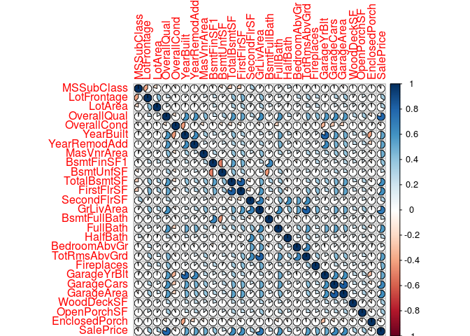
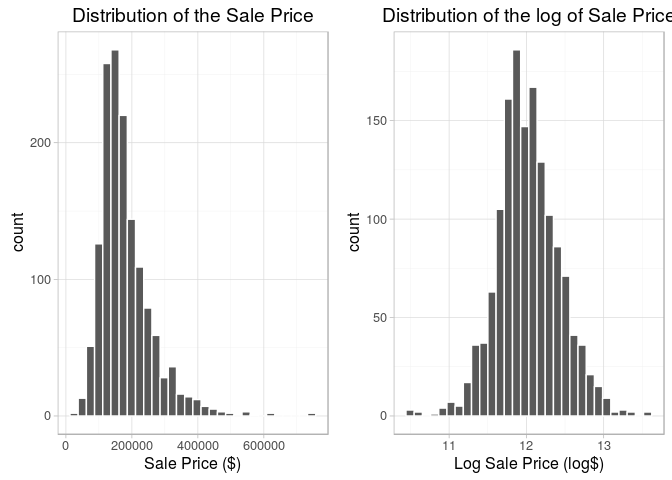
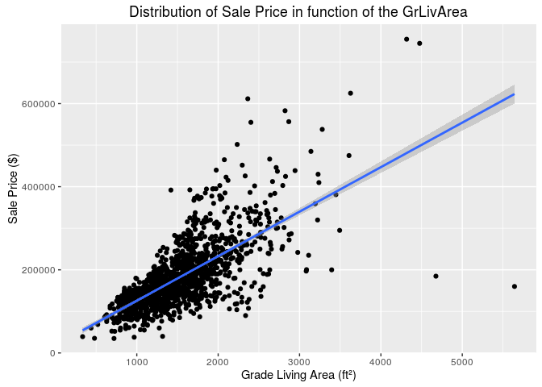
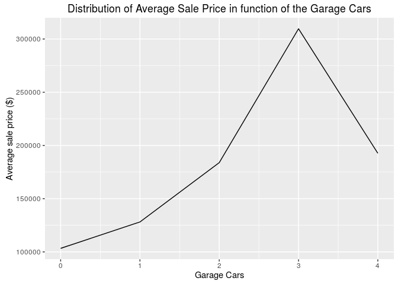
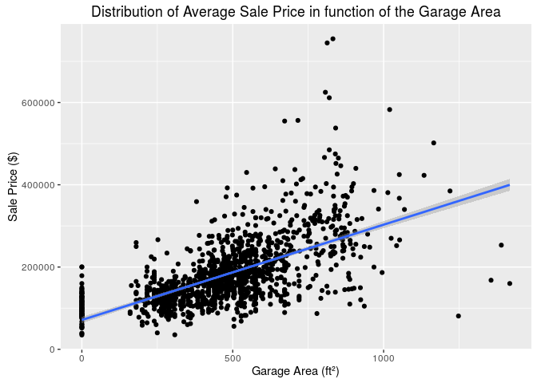
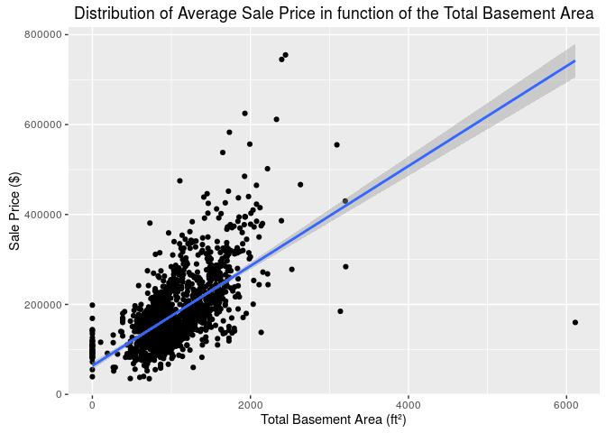

# House Prices
Gabriel Lapointe  
September 18, 2016  


# Data Acquisition


## Objective
With 79 explanatory variables describing (almost) every aspect of residential homes in Ames, Iowa, this competition challenges you to predict the final price of each home.


## Data Source
The data is provided by Kaggle at https://www.kaggle.com/c/house-prices-advanced-regression-techniques/data. 


## Dataset Questions
Before we start the exploration of the dataset, we need to write a list of questions about this dataset considering the problem we have to solve. 

* How big is the dataset?
* Does the dataset contains `NA` or missing values? Can we replace them by a value? Why?
* Does the data is coherent (date with same format, no out of bound values, no misspelled words, etc.)?
* What does the data look like and what are the relationships between features if they exist?
* What are the measures used?
* Can we solve the problem with this dataset?


## Evaluation Metrics
Submissions are evaluated on Root-Mean-Squared-Error (RMSE) between the logarithm of the predicted value and the logarithm of the observed sales price. (Taking logs means that errors in predicting expensive houses and cheap houses will affect the result equally.)


## Methodology
In this document, we start by exploring the dataset and build the data story behind it. This will give us important insights which will answer our questions on this dataset. The next step is to proceed to feature engineering which consists to create, remove or replace features regarding insights we got when exploring the dataset. Then, we will peoceed to a features selection to know which features are strongly correlated to the outcome. We will ensure our new dataset is a valid input for each of our prediction models. We will fine-tune the model's parameters by cross-validating the model with the train set to get the optimal parameters. After applying our model to the test set, we will visualize the predictions calculated and explain the results. Finally, we will give our recommandations to fulfill the objective of this project.


<!------------------------------------------------------------EXPLORATORY ANALYSIS------------------------------------------------------------------------------>


# Data Exploratory
In this section, we explore the dataset and we test hypotheses on features. The objective is to visualize and understand the relationships between features in the dataset we have to solve the problem. We will also compare changes we will make to this dataset to validate if they have significant influance on the outcome or not.

A house buyer could be interested to know the following features about the house:

* Number of bedrooms
* Number of bathrooms
* Total Number of rooms
* Is there a basement
* Is there a garage and how many cars can enter if yes
* The area of the house's land 
* The general quality


## Loading Dataset
We load 'train.csv' and 'test.csv'. Then, we merge them to proceed to the exploration of the entire dataset.


```r
library(data.table)
library(dplyr)
library(scales)
library(gridExtra)
library(ggplot2)
library(corrplot)

setwd("/home/gabriel/Documents/Projects/HousePrices")
#source("Visualisation.R")
#source("Dataset.R")

## Remove scientific notation (e.g. E-005).
options(scipen = 999)

set.seed(1234)

na.strings <- c("NA")
train <- fread(input = "train.csv", 
               showProgress = FALSE,
               stringsAsFactors = FALSE, 
               na.strings = na.strings, 
               header = TRUE)

test <- fread(input = "test.csv", 
              showProgress = FALSE,
              stringsAsFactors = FALSE, 
              na.strings = na.strings, 
              header = TRUE)

test$SalePrice <- -1
dataset <- rbind(train, test)
```


## Coherence of the Dataset
We have to check if the dataset is valid with the possible values given in the code book. Thus, we need to ensure that there are no mispelled words or no values that are not in the code book. Also, all numerical values should be coherent with their description meaning that their bounds have to be logiclly correct. Regarding the code book, none of the categorical features have over 25 features. We display the unique values for each features where the number of unique values is less or equal than 25. Then, we will compare the values mentioned in the code book with the values we have in the dataset.


```r
getUniqueValues <- function(feature)
{
    feature.values <- unique(feature)
    if(length(feature.values) <= 25)
    {
        paste(sort(feature.values, na.last = TRUE), collapse = ", ")
    }
}

sapply(dataset, getUniqueValues)
```

```
## $Id
## NULL
## 
## $MSSubClass
## [1] "20, 30, 40, 45, 50, 60, 70, 75, 80, 85, 90, 120, 150, 160, 180, 190"
## 
## $MSZoning
## [1] "C (all), FV, RH, RL, RM, NA"
## 
## $LotFrontage
## NULL
## 
## $LotArea
## NULL
## 
## $Street
## [1] "Grvl, Pave"
## 
## $Alley
## [1] ", Grvl, Pave, NA"
## 
## $LotShape
## [1] "IR1, IR2, IR3, Reg"
## 
## $LandContour
## [1] "Bnk, HLS, Low, Lvl"
## 
## $Utilities
## [1] "AllPub, NoSeWa, NA"
## 
## $LotConfig
## [1] "Corner, CulDSac, FR2, FR3, Inside"
## 
## $LandSlope
## [1] "Gtl, Mod, Sev"
## 
## $Neighborhood
## [1] "Blmngtn, Blueste, BrDale, BrkSide, ClearCr, CollgCr, Crawfor, Edwards, Gilbert, IDOTRR, MeadowV, Mitchel, NAmes, NoRidge, NPkVill, NridgHt, NWAmes, OldTown, Sawyer, SawyerW, Somerst, StoneBr, SWISU, Timber, Veenker"
## 
## $Condition1
## [1] "Artery, Feedr, Norm, PosA, PosN, RRAe, RRAn, RRNe, RRNn"
## 
## $Condition2
## [1] "Artery, Feedr, Norm, PosA, PosN, RRAe, RRAn, RRNn"
## 
## $BldgType
## [1] "1Fam, 2fmCon, Duplex, Twnhs, TwnhsE"
## 
## $HouseStyle
## [1] "1.5Fin, 1.5Unf, 1Story, 2.5Fin, 2.5Unf, 2Story, SFoyer, SLvl"
## 
## $OverallQual
## [1] "1, 2, 3, 4, 5, 6, 7, 8, 9, 10"
## 
## $OverallCond
## [1] "1, 2, 3, 4, 5, 6, 7, 8, 9"
## 
## $YearBuilt
## NULL
## 
## $YearRemodAdd
## NULL
## 
## $RoofStyle
## [1] "Flat, Gable, Gambrel, Hip, Mansard, Shed"
## 
## $RoofMatl
## [1] "ClyTile, CompShg, Membran, Metal, Roll, Tar&Grv, WdShake, WdShngl"
## 
## $Exterior1st
## [1] "AsbShng, AsphShn, BrkComm, BrkFace, CBlock, CemntBd, HdBoard, ImStucc, MetalSd, Plywood, Stone, Stucco, VinylSd, Wd Sdng, WdShing, NA"
## 
## $Exterior2nd
## [1] "AsbShng, AsphShn, Brk Cmn, BrkFace, CBlock, CmentBd, HdBoard, ImStucc, MetalSd, Other, Plywood, Stone, Stucco, VinylSd, Wd Sdng, Wd Shng, NA"
## 
## $MasVnrType
## [1] "BrkCmn, BrkFace, None, Stone, NA"
## 
## $MasVnrArea
## NULL
## 
## $ExterQual
## [1] "Ex, Fa, Gd, TA"
## 
## $ExterCond
## [1] "Ex, Fa, Gd, Po, TA"
## 
## $Foundation
## [1] "BrkTil, CBlock, PConc, Slab, Stone, Wood"
## 
## $BsmtQual
## [1] "Ex, Fa, Gd, TA, NA"
## 
## $BsmtCond
## [1] "Fa, Gd, Po, TA, NA"
## 
## $BsmtExposure
## [1] "Av, Gd, Mn, No, NA"
## 
## $BsmtFinType1
## [1] "ALQ, BLQ, GLQ, LwQ, Rec, Unf, NA"
## 
## $BsmtFinSF1
## NULL
## 
## $BsmtFinType2
## [1] "ALQ, BLQ, GLQ, LwQ, Rec, Unf, NA"
## 
## $BsmtFinSF2
## NULL
## 
## $BsmtUnfSF
## NULL
## 
## $TotalBsmtSF
## NULL
## 
## $Heating
## [1] "Floor, GasA, GasW, Grav, OthW, Wall"
## 
## $HeatingQC
## [1] "Ex, Fa, Gd, Po, TA"
## 
## $CentralAir
## [1] "N, Y"
## 
## $Electrical
## [1] "FuseA, FuseF, FuseP, Mix, SBrkr, NA"
## 
## $`1stFlrSF`
## NULL
## 
## $`2ndFlrSF`
## NULL
## 
## $LowQualFinSF
## NULL
## 
## $GrLivArea
## NULL
## 
## $BsmtFullBath
## [1] "0, 1, 2, 3, NA"
## 
## $BsmtHalfBath
## [1] "0, 1, 2, NA"
## 
## $FullBath
## [1] "0, 1, 2, 3, 4"
## 
## $HalfBath
## [1] "0, 1, 2"
## 
## $BedroomAbvGr
## [1] "0, 1, 2, 3, 4, 5, 6, 8"
## 
## $KitchenAbvGr
## [1] "0, 1, 2, 3"
## 
## $KitchenQual
## [1] "Ex, Fa, Gd, TA, NA"
## 
## $TotRmsAbvGrd
## [1] "2, 3, 4, 5, 6, 7, 8, 9, 10, 11, 12, 13, 14, 15"
## 
## $Functional
## [1] "Maj1, Maj2, Min1, Min2, Mod, Sev, Typ, NA"
## 
## $Fireplaces
## [1] "0, 1, 2, 3, 4"
## 
## $FireplaceQu
## [1] "Ex, Fa, Gd, Po, TA, NA"
## 
## $GarageType
## [1] "2Types, Attchd, Basment, BuiltIn, CarPort, Detchd, NA"
## 
## $GarageYrBlt
## NULL
## 
## $GarageFinish
## [1] "Fin, RFn, Unf, NA"
## 
## $GarageCars
## [1] "0, 1, 2, 3, 4, 5, NA"
## 
## $GarageArea
## NULL
## 
## $GarageQual
## [1] "Ex, Fa, Gd, Po, TA, NA"
## 
## $GarageCond
## [1] "Ex, Fa, Gd, Po, TA, NA"
## 
## $PavedDrive
## [1] "N, P, Y"
## 
## $WoodDeckSF
## NULL
## 
## $OpenPorchSF
## NULL
## 
## $EnclosedPorch
## NULL
## 
## $`3SsnPorch`
## NULL
## 
## $ScreenPorch
## NULL
## 
## $PoolArea
## [1] "0, 144, 228, 368, 444, 480, 512, 519, 555, 561, 576, 648, 738, 800"
## 
## $PoolQC
## [1] ", Ex, Fa, Gd, NA"
## 
## $Fence
## [1] "GdPrv, GdWo, MnPrv, MnWw, NA"
## 
## $MiscFeature
## [1] ", Gar2, Othr, Shed, TenC, NA"
## 
## $MiscVal
## NULL
## 
## $MoSold
## [1] "1, 2, 3, 4, 5, 6, 7, 8, 9, 10, 11, 12"
## 
## $YrSold
## [1] "2006, 2007, 2008, 2009, 2010"
## 
## $SaleType
## [1] "COD, Con, ConLD, ConLI, ConLw, CWD, New, Oth, WD, NA"
## 
## $SaleCondition
## [1] "Abnorml, AdjLand, Alloca, Family, Normal, Partial"
## 
## $SalePrice
## NULL
```

Comparing with the code book's possible codes manually, the followings have difference:

| Feature            | Dataset      | CodeBook        |
| ------------------ | ------------ | --------------- |
| MSZoning           | C (all)      | C |
| MSZoning           | NA           | No corresponding value |
| Alley              | Empty string | No corresponding value |
| Utilities          | NA           | No corresponding value |
| Neighborhood       | NAmes        | Names (should be NAmes) |
| BldgType           | 2fmCon       | 2FmCon |
| BldgType           | Duplex       | Duplx |
| BldgType           | Twnhs        | TwnhsI |
| Exterior1st        | NA           | No corresponding value |
| Exterior2nd        | NA           | No corresponding value |
| Exterior2nd        | Wd Shng      | WdShing |
| MasVnrType         | NA           | No corresponding value |
| Electrical         | NA           | No corresponding value |
| KitchenQual        | NA           | No corresponding value |
| Functional         | NA           | No corresponding value |
| MiscFeature        | Empty string | No corresponding value |
| SaleType           | NA           | No corresponding value |
| Bedroom            | Named 'BedroomAbvGr' | | Named 'Bedroom', but to be coherent, it should be named 'BedroomAbvGr' |

To be coherent with the code book (assuming the code book is the truth), we will replace mispelled categories in the dataset by their corresponding one from the code book. Also, the empty strings and spaces will be replaced by NA. Note that we will assume that the string 'Twnhs' corresponds to the string 'TwnhsI' in the code book.


```r
feature.emptystring <- c("Alley", "MiscFeature")
dataset[, feature.emptystring] <- dataset %>%
    select(Alley, MiscFeature) %>%
    sapply(function(feature) gsub("^$|^ $", NA, feature))

dataset$MSZoning[dataset$MSZoning == "C (all)"] <- "C"

dataset$BldgType[dataset$BldgType == "2fmCon"] <- "2FmCon"
dataset$BldgType[dataset$BldgType == "Duplex"] <- "Duplx"
dataset$BldgType[dataset$BldgType == "Twnhs"] <- "TwnhsI"

dataset$Exterior2nd[dataset$Exterior2nd == "Wd Shng"] <- "WdShing"

unique(dataset$Alley)
```

```
## [1] NA     "Grvl" "Pave"
```

```r
unique(dataset$MSZoning)
```

```
## [1] "RL" "RM" "C"  "FV" "RH" NA
```

```r
unique(dataset$BldgType)
```

```
## [1] "1Fam"   "2FmCon" "Duplx"  "TwnhsE" "TwnhsI"
```

```r
unique(dataset$Exterior2nd)
```

```
##  [1] "VinylSd" "MetalSd" "WdShing" "HdBoard" "Plywood" "Wd Sdng" "CmentBd"
##  [8] "BrkFace" "Stucco"  "AsbShng" "Brk Cmn" "ImStucc" "AsphShn" "Stone"  
## [15] "Other"   "CBlock"  NA
```

Since we have feature names starting by a digit which is not allowed in programming language, we will rename them with their full name.

* 1stFlrSF renamed to FirstFlrSF
* 2ndFlrSF renamed to SecondFlrSF
* 3SsnPorch renamed to ThreeSsnPorch


```r
colnames(dataset)[colnames(dataset) == '1stFlrSF'] <- 'FirstFlrSF'
colnames(dataset)[colnames(dataset) == '2ndFlrSF'] <- 'SecondFlrSF'
colnames(dataset)[colnames(dataset) == '3SsnPorch'] <- 'ThreeSsnPorch'

train <- dataset[dataset$SalePrice > -1, ]
test <- dataset[dataset$SalePrice == -1, ]
```


## Missing Values
Per the code book of this dataset, we know that the NA values mean 'No' or 'None' and they are used only for categorical features. The other NA values that are not in the code book will be interpreted as if we do not have information for the house's feature. this goes also for the empty strings that will be replaced by NA. Thus, we will replace all of them by zero without losing any information.

Also, we expect for numeric features that the value 0 means the same thing as a NA value. For example, a garage area of 0 means that there is no garage with this house. However, if the value 0 is used for an amount of money, then it is a real 0.


## Features
Here is the list of features with their type.


```
## Classes 'data.table' and 'data.frame':	2919 obs. of  81 variables:
##  $ Id           : int  1 2 3 4 5 6 7 8 9 10 ...
##  $ MSSubClass   : int  60 20 60 70 60 50 20 60 50 190 ...
##  $ MSZoning     : chr  "RL" "RL" "RL" "RL" ...
##  $ LotFrontage  : int  65 80 68 60 84 85 75 NA 51 50 ...
##  $ LotArea      : int  8450 9600 11250 9550 14260 14115 10084 10382 6120 7420 ...
##  $ Street       : chr  "Pave" "Pave" "Pave" "Pave" ...
##  $ Alley        : chr  NA NA NA NA ...
##  $ LotShape     : chr  "Reg" "Reg" "IR1" "IR1" ...
##  $ LandContour  : chr  "Lvl" "Lvl" "Lvl" "Lvl" ...
##  $ Utilities    : chr  "AllPub" "AllPub" "AllPub" "AllPub" ...
##  $ LotConfig    : chr  "Inside" "FR2" "Inside" "Corner" ...
##  $ LandSlope    : chr  "Gtl" "Gtl" "Gtl" "Gtl" ...
##  $ Neighborhood : chr  "CollgCr" "Veenker" "CollgCr" "Crawfor" ...
##  $ Condition1   : chr  "Norm" "Feedr" "Norm" "Norm" ...
##  $ Condition2   : chr  "Norm" "Norm" "Norm" "Norm" ...
##  $ BldgType     : chr  "1Fam" "1Fam" "1Fam" "1Fam" ...
##  $ HouseStyle   : chr  "2Story" "1Story" "2Story" "2Story" ...
##  $ OverallQual  : int  7 6 7 7 8 5 8 7 7 5 ...
##  $ OverallCond  : int  5 8 5 5 5 5 5 6 5 6 ...
##  $ YearBuilt    : int  2003 1976 2001 1915 2000 1993 2004 1973 1931 1939 ...
##  $ YearRemodAdd : int  2003 1976 2002 1970 2000 1995 2005 1973 1950 1950 ...
##  $ RoofStyle    : chr  "Gable" "Gable" "Gable" "Gable" ...
##  $ RoofMatl     : chr  "CompShg" "CompShg" "CompShg" "CompShg" ...
##  $ Exterior1st  : chr  "VinylSd" "MetalSd" "VinylSd" "Wd Sdng" ...
##  $ Exterior2nd  : chr  "VinylSd" "MetalSd" "VinylSd" "WdShing" ...
##  $ MasVnrType   : chr  "BrkFace" "None" "BrkFace" "None" ...
##  $ MasVnrArea   : int  196 0 162 0 350 0 186 240 0 0 ...
##  $ ExterQual    : chr  "Gd" "TA" "Gd" "TA" ...
##  $ ExterCond    : chr  "TA" "TA" "TA" "TA" ...
##  $ Foundation   : chr  "PConc" "CBlock" "PConc" "BrkTil" ...
##  $ BsmtQual     : chr  "Gd" "Gd" "Gd" "TA" ...
##  $ BsmtCond     : chr  "TA" "TA" "TA" "Gd" ...
##  $ BsmtExposure : chr  "No" "Gd" "Mn" "No" ...
##  $ BsmtFinType1 : chr  "GLQ" "ALQ" "GLQ" "ALQ" ...
##  $ BsmtFinSF1   : int  706 978 486 216 655 732 1369 859 0 851 ...
##  $ BsmtFinType2 : chr  "Unf" "Unf" "Unf" "Unf" ...
##  $ BsmtFinSF2   : int  0 0 0 0 0 0 0 32 0 0 ...
##  $ BsmtUnfSF    : int  150 284 434 540 490 64 317 216 952 140 ...
##  $ TotalBsmtSF  : int  856 1262 920 756 1145 796 1686 1107 952 991 ...
##  $ Heating      : chr  "GasA" "GasA" "GasA" "GasA" ...
##  $ HeatingQC    : chr  "Ex" "Ex" "Ex" "Gd" ...
##  $ CentralAir   : chr  "Y" "Y" "Y" "Y" ...
##  $ Electrical   : chr  "SBrkr" "SBrkr" "SBrkr" "SBrkr" ...
##  $ FirstFlrSF   : int  856 1262 920 961 1145 796 1694 1107 1022 1077 ...
##  $ SecondFlrSF  : int  854 0 866 756 1053 566 0 983 752 0 ...
##  $ LowQualFinSF : int  0 0 0 0 0 0 0 0 0 0 ...
##  $ GrLivArea    : int  1710 1262 1786 1717 2198 1362 1694 2090 1774 1077 ...
##  $ BsmtFullBath : int  1 0 1 1 1 1 1 1 0 1 ...
##  $ BsmtHalfBath : int  0 1 0 0 0 0 0 0 0 0 ...
##  $ FullBath     : int  2 2 2 1 2 1 2 2 2 1 ...
##  $ HalfBath     : int  1 0 1 0 1 1 0 1 0 0 ...
##  $ BedroomAbvGr : int  3 3 3 3 4 1 3 3 2 2 ...
##  $ KitchenAbvGr : int  1 1 1 1 1 1 1 1 2 2 ...
##  $ KitchenQual  : chr  "Gd" "TA" "Gd" "Gd" ...
##  $ TotRmsAbvGrd : int  8 6 6 7 9 5 7 7 8 5 ...
##  $ Functional   : chr  "Typ" "Typ" "Typ" "Typ" ...
##  $ Fireplaces   : int  0 1 1 1 1 0 1 2 2 2 ...
##  $ FireplaceQu  : chr  NA "TA" "TA" "Gd" ...
##  $ GarageType   : chr  "Attchd" "Attchd" "Attchd" "Detchd" ...
##  $ GarageYrBlt  : int  2003 1976 2001 1998 2000 1993 2004 1973 1931 1939 ...
##  $ GarageFinish : chr  "RFn" "RFn" "RFn" "Unf" ...
##  $ GarageCars   : int  2 2 2 3 3 2 2 2 2 1 ...
##  $ GarageArea   : int  548 460 608 642 836 480 636 484 468 205 ...
##  $ GarageQual   : chr  "TA" "TA" "TA" "TA" ...
##  $ GarageCond   : chr  "TA" "TA" "TA" "TA" ...
##  $ PavedDrive   : chr  "Y" "Y" "Y" "Y" ...
##  $ WoodDeckSF   : int  0 298 0 0 192 40 255 235 90 0 ...
##  $ OpenPorchSF  : int  61 0 42 35 84 30 57 204 0 4 ...
##  $ EnclosedPorch: int  0 0 0 272 0 0 0 228 205 0 ...
##  $ ThreeSsnPorch: int  0 0 0 0 0 320 0 0 0 0 ...
##  $ ScreenPorch  : int  0 0 0 0 0 0 0 0 0 0 ...
##  $ PoolArea     : int  0 0 0 0 0 0 0 0 0 0 ...
##  $ PoolQC       : chr  "" "" "" "" ...
##  $ Fence        : chr  NA NA NA NA ...
##  $ MiscFeature  : chr  NA NA NA NA ...
##  $ MiscVal      : int  0 0 0 0 0 700 0 350 0 0 ...
##  $ MoSold       : int  2 5 9 2 12 10 8 11 4 1 ...
##  $ YrSold       : int  2008 2007 2008 2006 2008 2009 2007 2009 2008 2008 ...
##  $ SaleType     : chr  "WD" "WD" "WD" "WD" ...
##  $ SaleCondition: chr  "Normal" "Normal" "Normal" "Abnorml" ...
##  $ SalePrice    : num  208500 181500 223500 140000 250000 ...
##  - attr(*, ".internal.selfref")=<externalptr>
```

We see now a plot of the correlation between numeric features of the train set.

<!-- -->

```
##               SalePriceCorrelation
## SalePrice                1.0000000
## OverallQual              0.7978807
## GrLivArea                0.7051536
## GarageCars               0.6470336
## GarageArea               0.6193296
## TotalBsmtSF              0.6156122
## FirstFlrSF               0.6079691
## FullBath                 0.5666274
## TotRmsAbvGrd             0.5470674
## YearBuilt                0.5253936
## YearRemodAdd             0.5212533
## GarageYrBlt              0.5047530
## MasVnrArea               0.4886582
## Fireplaces               0.4618727
## BsmtFinSF1               0.3903005
## LotFrontage              0.3442698
## OpenPorchSF              0.3433538
## WoodDeckSF               0.3368551
## SecondFlrSF              0.3068790
## LotArea                  0.2999622
## HalfBath                 0.2685603
## BsmtFullBath             0.2367374
## BsmtUnfSF                0.2131287
## BedroomAbvGr             0.1668139
## MSSubClass              -0.0880317
## OverallCond             -0.1243912
## EnclosedPorch           -0.1548432
```

Regarding the sale price, we note that some features are more than 60% correlated with the sale price. We will produce plots for each of them to get insights.


## Sale Price
The sale price should follow the normal distribution. However, we need to normalize the sale price by taking its logarithm.

<!-- -->

```
##    Min. 1st Qu.  Median    Mean 3rd Qu.    Max. 
##   34900  130000  163000  180900  214000  755000
```


## Overall Quality Rate
The overall quality rate is the most correlated feature to the sale price as seen previously. We look at the average sale price for each overall quality rate and try to figure out an equation that will best approximate our data.


```
## Source: local data table [10 x 2]
## 
##    OverallQual MeanSalePrice
##          (int)         (dbl)
## 1            1      50150.00
## 2            2      51770.33
## 3            3      87473.75
## 4            4     108420.66
## 5            5     133523.35
## 6            6     161603.03
## 7            7     207716.42
## 8            8     274735.54
## 9            9     367513.02
## 10          10     438588.39
```

<!-- -->

Note that the equation used to approximate is a parabola where the equation has been built from 3 points (OverallQual, MeanSalePrice) where the overall quality rates chosen are 1, 6 and 10 with their corresponding average sale price. The equation used to approximate is $M(Q) = \dfrac{939113}{180}Q^2-\dfrac{2561483}{180}Q+\dfrac{354979}{6}$ where $Q$ is the overall quality rate and $M(Q)$ is the mean sale price in function of $Q$.


## Above grade (ground) living area


<!-- -->


## Garage Cars


```
## Source: local data table [5 x 2]
## 
##   GarageCars MeanSalePrice
##        (int)         (dbl)
## 1          0      103317.3
## 2          1      128116.7
## 3          2      183851.7
## 4          3      309636.1
## 5          4      192655.8
```

<!-- -->


## Garage Area


<!-- -->


## Total Basement Area


<!-- -->


## First Floor Area


<!-- -->


# Feature Selection


# Feature Engineering


# Models Building


# Results


# Conclusion
