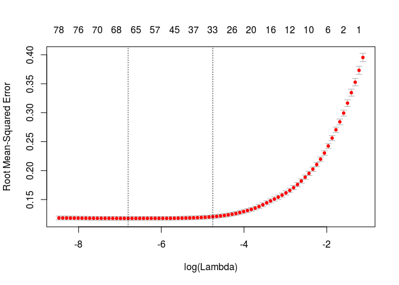

# House Prices
Gabriel Lapointe  
September 18, 2016  

# Objectives


## Business Objective
We have to answer this question: How do home features add up to its price tag?


## Technical Objective
With 79 explanatory variables describing (almost) every aspect of residential homes in Ames, Iowa, we have to predict the final price of each home.


# Data Acquisition
In this section, we will ask questions on the dataset and establish a methodology to solve the problem.


## Data Source
The data is provided by Kaggle and can be found [here](https://www.kaggle.com/c/house-prices-advanced-regression-techniques/data).


## Dataset Questions
Before we start the exploration of the dataset, we need to write a list of questions about this dataset considering the problem we have to solve. 

* How big is the dataset?
* Does the dataset contains 'NA' or missing values? Can we replace them by a value? Why?
* Does the data is coherent (date with same format, no out of bound values, no misspelled words, etc.)?
* What does the data look like and what are the relationships between features if they exist?
* What are the measures used?
* Does the dataset contains abnormal data?
* Can we solve the problem with this dataset?


## Evaluation Metrics
Submissions are evaluated on Root-Mean-Squared-Error (RMSE) between the logarithm of the predicted value and the logarithm of the observed sales price. (Taking logs means that errors in predicting expensive houses and cheap houses will affect the result equally.)


## Methodology
In this document, we start by cleaning and exploring the dataset to build the data story behind it. This will give us important insights which will answer our questions on this dataset. The next step is to proceed to feature engineering which consists to create, remove or replace features regarding insights we got when exploring the dataset. We will ensure our new dataset is a valid input for each of our prediction models. We will fine-tune the model's parameters by cross-validating the model with the train set to get the optimal parameters. After applying our model to the test set, we will visualize the predictions calculated and explain the results. Finally, we will conclude on most useful features to fulfill the business objective of this project.


## Loading Dataset
We load 'train.csv' and 'test.csv'. Then, we merge them to proceed to the cleaning and exploration of this entire dataset.


```r
library(data.table)      # setDT, set
library(dplyr)           # select, filter, %>%
library(scales)          # Scaling functions used for ggplot
library(gridExtra)       # Grid of ggplot to save space
library(ggplot2)         # ggplot functions for visualization and exploration
library(caret)
library(corrplot)
library(moments)         # For skewness
library(Matrix)
#library(mice)            # To replace NA values by a predicted one
library(Hmisc)           # To impute features having NA values to replace
library(VIM)
library(randomForest)
library(xgboost)
library(glmnet)
library(microbenchmark)  # benchmarking functions
library(knitr)           # opts_chunk

setwd("/home/gabriel/Documents/Projects/HousePrices")

set.seed(1234)

source("Dataset.R")

## Remove scientific notation (e.g. E-005).
options(scipen = 999)

## Remove hash symbols when printing results and do not show message or warning everywhere in this document.
opts_chunk$set(message = FALSE,
               warning = FALSE,
               comment = NA)

'%nin%' <- Negate('%in%')

## Read csv files and ensure NA strings are converted to real NA.
system.time({
    na.strings <- c("NA", "", " ")
    train <- fread(input = "train.csv", 
                   showProgress = FALSE,
                   stringsAsFactors = FALSE, 
                   na.strings = na.strings, 
                   header = TRUE)
    
    test <- fread(input = "test.csv", 
                  showProgress = FALSE,
                  stringsAsFactors = FALSE, 
                  na.strings = na.strings, 
                  header = TRUE)
    
    ## Merge the train and test sets in a data.table object.
    test$SalePrice <- -1
    dataset <- rbindlist(list(train, test), use.names = TRUE)
})
```

```
   user  system elapsed 
  0.027   0.000   0.027 
```

| Dataset            |  File Size (Kb) | # Houses              | # Features            |
| ------------------ | --------------- | --------------------- | --------------------- |
| train.csv          | 460.7           | 1460       | 81       |
| test.csv           | 451.4           | 1459        | 80    |
| **Total(dataset)** | **912.1**       | **2919** | **81** |

These datasets are very small. Each observation (row) is a house where we want to predict their sale price in the test set.


<!------------------------------------------------------------DATASET CLEANING------------------------------------------------------------------------------>


# Dataset Cleaning
The objective of this section is to detect all inconsistancies in the dataset and try to fix them all to gain as much coherence and accuracy as possible. We have to check if the dataset is valid with the possible values given in the code book. Thus, we need to ensure that there are no mispelled words or no values that are not in the code book. Also, all numerical values should be coherent with their description meaning that their bounds have to be logically correct. Regarding the code book, none of the categorical features have over 25 unique values. Then, we will compare the values mentioned in the code book with the values we have in the dataset. Finally, we have to detect anomalies and determine techniques to replace missing values with the most accurate ones.


```
$Id
NULL

$MSSubClass
[1] "20, 30, 40, 45, 50, 60, 70, 75, 80, 85, 90, 120, 150, 160, 180, 190"

$MSZoning
[1] "C (all), FV, RH, RL, RM, NA"

$LotFrontage
NULL

$LotArea
NULL

$Street
[1] "Grvl, Pave"

$Alley
[1] "Grvl, Pave, NA"

$LotShape
[1] "IR1, IR2, IR3, Reg"

$LandContour
[1] "Bnk, HLS, Low, Lvl"

$Utilities
[1] "AllPub, NoSeWa, NA"

$LotConfig
[1] "Corner, CulDSac, FR2, FR3, Inside"

$LandSlope
[1] "Gtl, Mod, Sev"

$Neighborhood
[1] "Blmngtn, Blueste, BrDale, BrkSide, ClearCr, CollgCr, Crawfor, Edwards, Gilbert, IDOTRR, MeadowV, Mitchel, NAmes, NoRidge, NPkVill, NridgHt, NWAmes, OldTown, Sawyer, SawyerW, Somerst, StoneBr, SWISU, Timber, Veenker"

$Condition1
[1] "Artery, Feedr, Norm, PosA, PosN, RRAe, RRAn, RRNe, RRNn"

$Condition2
[1] "Artery, Feedr, Norm, PosA, PosN, RRAe, RRAn, RRNn"

$BldgType
[1] "1Fam, 2fmCon, Duplex, Twnhs, TwnhsE"

$HouseStyle
[1] "1.5Fin, 1.5Unf, 1Story, 2.5Fin, 2.5Unf, 2Story, SFoyer, SLvl"

$OverallQual
[1] "1, 2, 3, 4, 5, 6, 7, 8, 9, 10"

$OverallCond
[1] "1, 2, 3, 4, 5, 6, 7, 8, 9"

$YearBuilt
NULL

$YearRemodAdd
NULL

$RoofStyle
[1] "Flat, Gable, Gambrel, Hip, Mansard, Shed"

$RoofMatl
[1] "ClyTile, CompShg, Membran, Metal, Roll, Tar&Grv, WdShake, WdShngl"

$Exterior1st
[1] "AsbShng, AsphShn, BrkComm, BrkFace, CBlock, CemntBd, HdBoard, ImStucc, MetalSd, Plywood, Stone, Stucco, VinylSd, Wd Sdng, WdShing, NA"

$Exterior2nd
[1] "AsbShng, AsphShn, Brk Cmn, BrkFace, CBlock, CmentBd, HdBoard, ImStucc, MetalSd, Other, Plywood, Stone, Stucco, VinylSd, Wd Sdng, Wd Shng, NA"

$MasVnrType
[1] "BrkCmn, BrkFace, None, Stone, NA"

$MasVnrArea
NULL

$ExterQual
[1] "Ex, Fa, Gd, TA"

$ExterCond
[1] "Ex, Fa, Gd, Po, TA"

$Foundation
[1] "BrkTil, CBlock, PConc, Slab, Stone, Wood"

$BsmtQual
[1] "Ex, Fa, Gd, TA, NA"

$BsmtCond
[1] "Fa, Gd, Po, TA, NA"

$BsmtExposure
[1] "Av, Gd, Mn, No, NA"

$BsmtFinType1
[1] "ALQ, BLQ, GLQ, LwQ, Rec, Unf, NA"

$BsmtFinSF1
NULL

$BsmtFinType2
[1] "ALQ, BLQ, GLQ, LwQ, Rec, Unf, NA"

$BsmtFinSF2
NULL

$BsmtUnfSF
NULL

$TotalBsmtSF
NULL

$Heating
[1] "Floor, GasA, GasW, Grav, OthW, Wall"

$HeatingQC
[1] "Ex, Fa, Gd, Po, TA"

$CentralAir
[1] "N, Y"

$Electrical
[1] "FuseA, FuseF, FuseP, Mix, SBrkr, NA"

$`1stFlrSF`
NULL

$`2ndFlrSF`
NULL

$LowQualFinSF
NULL

$GrLivArea
NULL

$BsmtFullBath
[1] "0, 1, 2, 3, NA"

$BsmtHalfBath
[1] "0, 1, 2, NA"

$FullBath
[1] "0, 1, 2, 3, 4"

$HalfBath
[1] "0, 1, 2"

$BedroomAbvGr
[1] "0, 1, 2, 3, 4, 5, 6, 8"

$KitchenAbvGr
[1] "0, 1, 2, 3"

$KitchenQual
[1] "Ex, Fa, Gd, TA, NA"

$TotRmsAbvGrd
[1] "2, 3, 4, 5, 6, 7, 8, 9, 10, 11, 12, 13, 14, 15"

$Functional
[1] "Maj1, Maj2, Min1, Min2, Mod, Sev, Typ, NA"

$Fireplaces
[1] "0, 1, 2, 3, 4"

$FireplaceQu
[1] "Ex, Fa, Gd, Po, TA, NA"

$GarageType
[1] "2Types, Attchd, Basment, BuiltIn, CarPort, Detchd, NA"

$GarageYrBlt
NULL

$GarageFinish
[1] "Fin, RFn, Unf, NA"

$GarageCars
[1] "0, 1, 2, 3, 4, 5, NA"

$GarageArea
NULL

$GarageQual
[1] "Ex, Fa, Gd, Po, TA, NA"

$GarageCond
[1] "Ex, Fa, Gd, Po, TA, NA"

$PavedDrive
[1] "N, P, Y"

$WoodDeckSF
NULL

$OpenPorchSF
NULL

$EnclosedPorch
NULL

$`3SsnPorch`
NULL

$ScreenPorch
NULL

$PoolArea
[1] "0, 144, 228, 368, 444, 480, 512, 519, 555, 561, 576, 648, 738, 800"

$PoolQC
[1] "Ex, Fa, Gd, NA"

$Fence
[1] "GdPrv, GdWo, MnPrv, MnWw, NA"

$MiscFeature
[1] "Gar2, Othr, Shed, TenC, NA"

$MiscVal
NULL

$MoSold
[1] "1, 2, 3, 4, 5, 6, 7, 8, 9, 10, 11, 12"

$YrSold
[1] "2006, 2007, 2008, 2009, 2010"

$SaleType
[1] "COD, Con, ConLD, ConLI, ConLw, CWD, New, Oth, WD, NA"

$SaleCondition
[1] "Abnorml, AdjLand, Alloca, Family, Normal, Partial"

$SalePrice
NULL
```


## Feature Names Harmonization
We start by harmonizing the feature names to be coherent with the code book. Comparing manually with the code book's possible codes, the following features have differences:

| Feature            | Dataset      | CodeBook        |
| ------------------ | ------------ | --------------- |
| MSZoning           | C (all)      | C |
| MSZoning           | NA           | No corresponding value |
| Alley              | Empty string | No corresponding value |
| PoolQC             | Empty string | No corresponding value |
| Utilities          | NA           | No corresponding value |
| Neighborhood       | NAmes        | Names (should be NAmes) |
| BldgType           | 2fmCon       | 2FmCon |
| BldgType           | Duplex       | Duplx |
| BldgType           | Twnhs        | TwnhsI |
| Exterior1st        | NA           | No corresponding value |
| Exterior2nd        | NA           | No corresponding value |
| Exterior2nd        | Wd Shng      | WdShing |
| MasVnrType         | NA           | No corresponding value |
| Electrical         | NA           | No corresponding value |
| KitchenQual        | NA           | No corresponding value |
| Functional         | NA           | No corresponding value |
| MiscFeature        | Empty string | No corresponding value |
| SaleType           | NA           | No corresponding value |
| Bedroom            | Named 'BedroomAbvGr' | Should be named 'BedroomAbvGr' to follow the naming convention |
| Kitchen            | Named 'KitchenAbvGr' | Should be named 'KitchenAbvGr' to follow the naming convention |

The code book seems to have a naming convention but it is not always respected. Thus, it will be hard to achieve complete coherence. Since we do not know the reason behind each code and each feature name given, we will not change any of them in this code book. The changes will be done in the dataset only.

To be coherent with the code book (assuming the code book is the truth), we will replace mispelled categories in the dataset by their corresponding one from the code book. Note that we deduct that the string 'Twnhs' corresponds to the string 'TwnhsI' in the code book since the other codes can be easily associated.


```r
dataset <- dataset[MSZoning == "C (all)", MSZoning := "C"]

dataset <- dataset[BldgType == "2fmCon", BldgType := "2FmCon"]
dataset <- dataset[BldgType == "Duplex", BldgType := "Duplx"] 
dataset <- dataset[BldgType == "Twnhs", BldgType := "TwnhsI"] 

dataset <- dataset[Exterior2nd == "Wd Shng", Exterior2nd := "WdShing"]
```

Since we have feature names starting by a digit which is not allowed in many programming languages, we will rename them with their full name.


```r
colnames(dataset)[colnames(dataset) == "1stFlrSF"] <- "FirstFloorArea"
colnames(dataset)[colnames(dataset) == "2ndFlrSF"] <- "SecondFloorArea"
colnames(dataset)[colnames(dataset) == "3SsnPorch"] <- "ThreeSeasonPorchArea"
```


## Data Coherence
We also need to check the logic in the dataset to make sure the data make sense. We will enumerate facts coming from the code book and from logic to detect anomalies in this dataset.


**1. The feature 'FirstFloorArea' must not have an area of 0 ft². Otherwise, there would not have a first floor, thus no stories at all and then, no house.**

The minimum area of the first floor is 334 ft². Looking at features 'HouseStyle' and 'MSSubClass' in the code book, there is neither NA value nor another value indicating that there is no story in the house. Indeed, we have 0 NA values for 'HouseStyle' and 0 NA values for 'MSSubClass'.


**2. The HouseStyle feature values must match with the values of the feature MSSubClass.**

To check this fact, we have to do a mapping between values of 'HouseStyle' and 'MSSubClass'. We have to be careful with 'SLvl' and 'SFoyer' because they can be used for all types. Since we are not sure about them, we will validate with values we know they mismatch.

| HouseStyle | MSSubClass |
| -----------| ---------- |
| 1Story     |  20        |
| 1Story     |  30        |
| 1Story     |  40        |
| 1Story     | 120        |
| 1.5Fin     |  50        |
| 1.5Unf     |  45        |
| 2Story     |  60        |
| 2Story     |  70        |
| 2Story     | 160        |
| 2.5Fin     |  75        |
| 2.5Unf     |  75        |
| SFoyer     |  85        |
| SFoyer     | 180        |
| SLvl       |  80        |
| SLvl       | 180        |


```
Source: local data frame [44 x 4]

      Id HouseStyle BldgType MSSubClass
   (int)      (chr)    (chr)      (int)
1    608     2Story     1Fam         20
2    730     1.5Fin     1Fam         30
3   1444     1.5Unf     1Fam         30
4   2197     1.5Fin     1Fam         30
5   2555     1.5Fin     1Fam         40
6     75     2Story     1Fam         50
7     80     2Story     1Fam         50
8   1449     2Story     1Fam         50
9   2792     1.5Unf     1Fam         50
10  2881     2Story     1Fam         50
..   ...        ...      ...        ...
```


**3. Per the code book, values of MSSubClass for 1 and 2 stories must match with the YearBuilt.**

To verify this fact, we need to compare values of 'MSSubClass' with the 'YearBuilt' values. The fact is not respected if the year built is less than 1946 and values of 'MSSubClass' are 20, 60, 120 and 160. The case when the year built is 1946 and newer, and values of 'MSSubClass' are 30 and 70 also show that the fact is not respected.

```
Source: local data frame [8 x 5]

     Id YearBuilt MSSubClass BldgType HouseStyle
  (int)     (int)      (int)    (chr)      (chr)
1  1333      1938         20     1Fam     1Story
2  1783      1939         60     1Fam     2Story
3  2127      1910         60   2FmCon     2.5Unf
4  2487      1920         60     1Fam     2Story
5  2491      1945         20     1Fam     1Story
6   837      1948         30     1Fam     1Story
7  2130      1952         70     1Fam     2Story
8  2499      1958         30     1Fam     1Story
```

These features represents  % of the dataset.


**4. If there is no garage with the house, then GarageType = NA, GarageYrBlt = NA, GarageFinish = NA, GarageCars = 0, GarageArea = 0, GarageQual = NA and GarageCond = NA.**

We need to get all houses where the GarageType is NA and check if the this fact's conditions are respected.

```
     Id GarageType GarageYrBlt GarageFinish GarageQual GarageCond
1: 2127     Detchd          NA           NA         NA         NA
2: 2577     Detchd          NA           NA         NA         NA
   GarageArea GarageCars
1:        360          1
2:         NA         NA
```


**5. If there is no basement in the house, then TotalBsmtSF = 0, BsmtUnfSF = 0, BsmtFinSF2 = 0, BsmtHalfBath = 0, BsmtFullBath = 0, BsmtQual = NA and BsmtCond = NA, BsmtExposure = NA, BsmtFinType1 = NA, BsmtFinSF1 = 0, BsmtFinType2 = NA.**


```
     Id TotalBsmtSF BsmtUnfSF BsmtFinSF2 BsmtHalfBath BsmtFullBath
1: 2041        1426         0        382            0            1
2: 2121          NA        NA         NA           NA           NA
3: 2186        1127        94          0            1            0
4: 2189           0         0          0           NA           NA
5: 2218         173       173          0            0            0
6: 2219         356       356          0            0            0
7: 2525         995       240          0            0            0
   BsmtQual BsmtCond BsmtExposure BsmtFinType1 BsmtFinSF1 BsmtFinType2
1:       Gd       NA           Mn          GLQ       1044          Rec
2:       NA       NA           NA           NA         NA           NA
3:       TA       NA           No          BLQ       1033          Unf
4:       NA       NA           NA           NA          0           NA
5:       NA       Fa           No          Unf          0          Unf
6:       NA       TA           No          Unf          0          Unf
7:       TA       NA           Av          ALQ        755          Unf
```

```
     Id TotalBsmtSF BsmtUnfSF BsmtFinSF2 BsmtHalfBath BsmtFullBath
1: 2189           0         0          0           NA           NA
   BsmtQual BsmtCond BsmtExposure BsmtFinType1 BsmtFinSF1 BsmtFinType2
1:       NA       NA           NA           NA          0           NA
```


**6. Per the code book, if there are no fireplaces, then FireplaceQu = NA and Fireplaces = 0.**


```
Empty data.table (0 rows) of 3 cols: Id,Fireplaces,FireplaceQu
```

```
Empty data.table (0 rows) of 3 cols: Id,Fireplaces,FireplaceQu
```


**7. Per the code book, if there are no Pool, then PoolQC = NA and PoolArea = 0.**


```
     Id PoolArea PoolQC
1: 2421      368     NA
2: 2504      444     NA
3: 2600      561     NA
```

```
Empty data.table (0 rows) of 3 cols: Id,PoolArea,PoolQC
```


**8. Per the code book, the Remodel year is the same as the year built if no remodeling or additions. Then, it is true to say that YearRemodAdd $\geq$ YearBuilt.**

The abnormal houses that are not respecting this fact are detected by filtering houses having the remodel year less than the year built. If it is the case, then we can verify the year when the garage was built if exists and compare with the house year built and remodeled. 


```
     Id YearBuilt YearRemodAdd GarageYrBlt
1: 1877      2002         2001        2002
```


```r
dataset <- dataset[which(YearRemodAdd < YearBuilt), YearRemodAdd := YearBuilt]
```


**9. We verify that if the Garage Cars is 0, then the Garage Area is also 0. The converse is true since a Garage area of 0 means that there is no garage, thus no cars.**


```
Empty data.table (0 rows) of 3 cols: Id,GarageArea,GarageCars
```


**10. We have BsmtCond = NA (no basement per code book) if and only if BsmtQual = NA which means no basement per the code book.**


```
     Id BsmtCond BsmtQual
1: 2041       NA       Gd
2: 2186       NA       TA
3: 2525       NA       TA
```

```
     Id BsmtCond BsmtQual
1: 2218       Fa       NA
2: 2219       TA       NA
```


```r
dataset <- dataset[which(!is.na(BsmtCond) & is.na(BsmtQual)), BsmtQual := BsmtCond]
dataset <- dataset[which(is.na(BsmtCond) & !is.na(BsmtQual)), BsmtCond := BsmtQual]
```


**11. We have MasVnrType = None if and only if MasVnrArea = 0 ft².**

We have two cases where it is hard to check which one is right. 

* Case when MasVnrType = 'None' and MasVnrArea $\neq 0$ ft²
* Case when MasVnrType $\neq$ 'None' and MasVnrArea $= 0$ ft²


```
     Id MasVnrType MasVnrArea
1:  625       None        288
2:  774       None          1
3: 1231       None          1
4: 1301       None        344
5: 1335       None        312
6: 1670       None        285
7: 2453       None          1
```

```
     Id MasVnrType MasVnrArea
1:  689    BrkFace          0
2: 1242      Stone          0
3: 2320    BrkFace          0
```


```r
dataset <- dataset[which(MasVnrType != "None" & MasVnrArea == 0), MasVnrType := "None"]
dataset <- dataset[which(MasVnrType == "None" & MasVnrArea <= 10), MasVnrArea := 0]
```


## Missing Values
Per the code book of this dataset, we know that generally, the NA values mean 'No' or 'None' and they are used only for some categorical features. The other NA values that are not in the code book will be explained case by case. This goes also for the empty strings that will be replaced by NA. 

* Case when NA means 'None' or 'No'
* Case when an integer feature has 0 and NA as possible values
* Case when a numeric value has 0 and NA as possible values
* Case when a category is NA where NA means 'No', and the numeric feature is not zero
* Case when a category is not NA where NA means 'No', and the numeric feature is NA where 0 has a clear meaning

Features having NA values where NA means 'None' or 'No' will be replaced by 0.

However, it is possible to solve some NA values by analysing the value used for other features strongly related. For example, some integer features like GarageCars and GarageArea have NA values. At the first glance, we cannot state that NA means 0 since 0 already has a meaning. It could be a "No Information", but looking at the GarageQual and GarageCond features, we notice that their value is NA as well. This means that this house has no garage per the code book. Therefore, we will replace NA values by 0 for GarageArea and GarageCars.

For features like "BsmtFullBath", the value 0 means that we do not have full bathroom in the basement. Thus, we cannot replace NA by 0 if there is a basement. Otherwise, the house has no basement, thus no full bathroom in the basement. In this case only, we can replace NA by 0.

We expect that numeric features where the value 0 means the same thing as a NA value. For example, a garage area of 0 means that there is no garage with this house. However, if the value 0 is used for an amount of money or for a geometric measure (e.g. area), then it is a real 0.

For "year" features (e.g. GarageYrBlt), if the values are NA, then we can replace them by 0 without loss of generality. A year 0 is theorically possible, but in our context, it is impossible. But, using 0 will decrease the mean and will add noise to the data since the difference between the minimum year and zero is large: NA.

Another case is when a feature uses the value NA to indicate that the information is missing. For example, the feature "KitchenQual" is not supposed to have the value NA per the code book. If the value NA is used, then it really means "No Information" and we cannot replace it by 0. Normally, we would exclude this house of the dataset, but this house is taken from the test set, thus we must not remove it.

For those cases, we need to use imputation on missing data (NA value). We could calculate the mean for a given feature and use this value to replace NA values. But it is more accurate to predict what value to use by using the other features since we have many of them. 


```
                  Id           MSSubClass             MSZoning 
                   0                    0                    4 
         LotFrontage              LotArea               Street 
                 486                    0                    0 
               Alley             LotShape          LandContour 
                2721                    0                    0 
           Utilities            LotConfig            LandSlope 
                   2                    0                    0 
        Neighborhood           Condition1           Condition2 
                   0                    0                    0 
            BldgType           HouseStyle          OverallQual 
                   0                    0                    0 
         OverallCond            YearBuilt         YearRemodAdd 
                   0                    0                    0 
           RoofStyle             RoofMatl          Exterior1st 
                   0                    0                    1 
         Exterior2nd           MasVnrType           MasVnrArea 
                   1                   24                   23 
           ExterQual            ExterCond           Foundation 
                   0                    0                    0 
            BsmtQual             BsmtCond         BsmtExposure 
                  79                   79                   82 
        BsmtFinType1           BsmtFinSF1         BsmtFinType2 
                  79                    1                   80 
          BsmtFinSF2            BsmtUnfSF          TotalBsmtSF 
                   1                    1                    1 
             Heating            HeatingQC           CentralAir 
                   0                    0                    0 
          Electrical       FirstFloorArea      SecondFloorArea 
                   1                    0                    0 
        LowQualFinSF            GrLivArea         BsmtFullBath 
                   0                    0                    1 
        BsmtHalfBath             FullBath             HalfBath 
                   1                    0                    0 
        BedroomAbvGr         KitchenAbvGr          KitchenQual 
                   0                    0                    1 
        TotRmsAbvGrd           Functional           Fireplaces 
                   0                    2                    0 
         FireplaceQu           GarageType          GarageYrBlt 
                1420                  158                  159 
        GarageFinish           GarageCars           GarageArea 
                 159                    1                    1 
          GarageQual           GarageCond           PavedDrive 
                 159                  159                    0 
          WoodDeckSF          OpenPorchSF        EnclosedPorch 
                   0                    0                    0 
ThreeSeasonPorchArea          ScreenPorch             PoolArea 
                   0                    0                    0 
              PoolQC                Fence          MiscFeature 
                2909                 2348                 2814 
             MiscVal               MoSold               YrSold 
                   0                    0                    0 
            SaleType        SaleCondition            SalePrice 
                   1                    0                    0 
```

<!-- -->

```

 Variables sorted by number of missings: 
             Variable        Count
               PoolQC 0.9965741692
          MiscFeature 0.9640287770
                Alley 0.9321685509
                Fence 0.8043850634
          FireplaceQu 0.4864679685
          LotFrontage 0.1664953751
          GarageYrBlt 0.0544707091
         GarageFinish 0.0544707091
           GarageQual 0.0544707091
           GarageCond 0.0544707091
           GarageType 0.0541281261
         BsmtExposure 0.0280918123
         BsmtFinType2 0.0274066461
             BsmtQual 0.0270640630
             BsmtCond 0.0270640630
         BsmtFinType1 0.0270640630
           MasVnrType 0.0082219938
           MasVnrArea 0.0078794108
             MSZoning 0.0013703323
            Utilities 0.0006851662
           Functional 0.0006851662
          Exterior1st 0.0003425831
          Exterior2nd 0.0003425831
           BsmtFinSF1 0.0003425831
           BsmtFinSF2 0.0003425831
            BsmtUnfSF 0.0003425831
          TotalBsmtSF 0.0003425831
           Electrical 0.0003425831
         BsmtFullBath 0.0003425831
         BsmtHalfBath 0.0003425831
          KitchenQual 0.0003425831
           GarageCars 0.0003425831
           GarageArea 0.0003425831
             SaleType 0.0003425831
                   Id 0.0000000000
           MSSubClass 0.0000000000
              LotArea 0.0000000000
               Street 0.0000000000
             LotShape 0.0000000000
          LandContour 0.0000000000
            LotConfig 0.0000000000
            LandSlope 0.0000000000
         Neighborhood 0.0000000000
           Condition1 0.0000000000
           Condition2 0.0000000000
             BldgType 0.0000000000
           HouseStyle 0.0000000000
          OverallQual 0.0000000000
          OverallCond 0.0000000000
            YearBuilt 0.0000000000
         YearRemodAdd 0.0000000000
            RoofStyle 0.0000000000
             RoofMatl 0.0000000000
            ExterQual 0.0000000000
            ExterCond 0.0000000000
           Foundation 0.0000000000
              Heating 0.0000000000
            HeatingQC 0.0000000000
           CentralAir 0.0000000000
       FirstFloorArea 0.0000000000
      SecondFloorArea 0.0000000000
         LowQualFinSF 0.0000000000
            GrLivArea 0.0000000000
             FullBath 0.0000000000
             HalfBath 0.0000000000
         BedroomAbvGr 0.0000000000
         KitchenAbvGr 0.0000000000
         TotRmsAbvGrd 0.0000000000
           Fireplaces 0.0000000000
           PavedDrive 0.0000000000
           WoodDeckSF 0.0000000000
          OpenPorchSF 0.0000000000
        EnclosedPorch 0.0000000000
 ThreeSeasonPorchArea 0.0000000000
          ScreenPorch 0.0000000000
             PoolArea 0.0000000000
              MiscVal 0.0000000000
               MoSold 0.0000000000
               YrSold 0.0000000000
        SaleCondition 0.0000000000
            SalePrice 0.0000000000
```

For the Masonry veneer type (MasVnrType) feature, the value "None" means that the house does not have a masonry veneer per the code book. If some houses have the value NA, then it will mean that the information is missing. 

Note that it is possible to have information on the masonry veneer area but not on the type (vice-versa could be possible as well). In that case, we cannot deduct with certainty what will be the value to replace NA. We cannot replace NA by 0 for the area because 0 means *None* which is a valid choice. The best choice we can take is to replace NA value by the mean value of the feature.


<!------------------------------------------------------------ANOMALIES DETECTION------------------------------------------------------------------------------>


# Anomalies Detection
In this section, the objective is to detect houses or features having wrong or illogic information. We will fix them if it is possible.

We define a house as being an anomaly if $\left\lVert Y - P \right\rVert > \epsilon$ where $Y = (x, y)$ is the point belonging to the regression linear model and $P = (x, z)$ a point not on the regression linear model. Also, $x$ is the ground living area, $y$ and $z$ the sale price, and $\epsilon > 0$ the threshold.

Regarding the overall quality, the sale price and the ground living area, we expect that the sale price will increase when the overall quality increases and the ground living area increases. This is verified in the data exploratory section. 

Taking houses having their overall quality = 10 and their ground living area greater than 4000 ft², the sale price should be part of the highest sale prices. If there are houses respecting these conditions with a sale price over 240000$ than what the regression model gives, then this may be possible, but if it is lower, than this is exceptionnel. 


```
     Id GrLivArea SalePrice
1:  524      4676    184750
2:  692      4316    755000
3: 1183      4476    745000
4: 1299      5642    160000
```

```
     Id ApproxPrice SalePrice PriceDifference
1:  524    519510.6    184750        334760.6
2:  692    480943.7    755000        274056.3
3: 1183    498084.5    745000        246915.5
4: 1299    622998.5    160000        462998.5
```

After visualizing, we detected another anomaly concerning the garage year built. Since the year cannot be greater than 2010, years greater than that year will be treated as an anomaly.


```
     Id GarageYrBlt YearBuilt YrSold
1: 2593        2207      2006   2007
```


```r
dataset <- dataset[GarageYrBlt > max(YrSold), GarageYrBlt := YrSold]
```


<!------------------------------------------------------------DATA EXPLORATORY------------------------------------------------------------------------------>


# Data Exploratory
The objective is to visualize and understand the relationships between features in the dataset we have to solve the problem. We will also compare changes we will make to this dataset to validate if they have significant influance on the sale price or not.


## Features
Here is the list of features with their type.


```
Classes 'data.table' and 'data.frame':	2915 obs. of  81 variables:
 $ Id                  : int  1 2 3 4 5 6 7 8 9 10 ...
 $ MSSubClass          : int  60 20 60 70 60 50 20 60 50 190 ...
 $ MSZoning            : chr  "RL" "RL" "RL" "RL" ...
 $ LotFrontage         : int  65 80 68 60 84 85 75 NA 51 50 ...
 $ LotArea             : int  8450 9600 11250 9550 14260 14115 10084 10382 6120 7420 ...
 $ Street              : chr  "Pave" "Pave" "Pave" "Pave" ...
 $ Alley               : chr  NA NA NA NA ...
 $ LotShape            : chr  "Reg" "Reg" "IR1" "IR1" ...
 $ LandContour         : chr  "Lvl" "Lvl" "Lvl" "Lvl" ...
 $ Utilities           : chr  "AllPub" "AllPub" "AllPub" "AllPub" ...
 $ LotConfig           : chr  "Inside" "FR2" "Inside" "Corner" ...
 $ LandSlope           : chr  "Gtl" "Gtl" "Gtl" "Gtl" ...
 $ Neighborhood        : chr  "CollgCr" "Veenker" "CollgCr" "Crawfor" ...
 $ Condition1          : chr  "Norm" "Feedr" "Norm" "Norm" ...
 $ Condition2          : chr  "Norm" "Norm" "Norm" "Norm" ...
 $ BldgType            : chr  "1Fam" "1Fam" "1Fam" "1Fam" ...
 $ HouseStyle          : chr  "2Story" "1Story" "2Story" "2Story" ...
 $ OverallQual         : int  7 6 7 7 8 5 8 7 7 5 ...
 $ OverallCond         : int  5 8 5 5 5 5 5 6 5 6 ...
 $ YearBuilt           : int  2003 1976 2001 1915 2000 1993 2004 1973 1931 1939 ...
 $ YearRemodAdd        : int  2003 1976 2002 1970 2000 1995 2005 1973 1950 1950 ...
 $ RoofStyle           : chr  "Gable" "Gable" "Gable" "Gable" ...
 $ RoofMatl            : chr  "CompShg" "CompShg" "CompShg" "CompShg" ...
 $ Exterior1st         : chr  "VinylSd" "MetalSd" "VinylSd" "Wd Sdng" ...
 $ Exterior2nd         : chr  "VinylSd" "MetalSd" "VinylSd" "WdShing" ...
 $ MasVnrType          : chr  "BrkFace" "None" "BrkFace" "None" ...
 $ MasVnrArea          : int  196 0 162 0 350 0 186 240 0 0 ...
 $ ExterQual           : chr  "Gd" "TA" "Gd" "TA" ...
 $ ExterCond           : chr  "TA" "TA" "TA" "TA" ...
 $ Foundation          : chr  "PConc" "CBlock" "PConc" "BrkTil" ...
 $ BsmtQual            : chr  "Gd" "Gd" "Gd" "TA" ...
 $ BsmtCond            : chr  "TA" "TA" "TA" "Gd" ...
 $ BsmtExposure        : chr  "No" "Gd" "Mn" "No" ...
 $ BsmtFinType1        : chr  "GLQ" "ALQ" "GLQ" "ALQ" ...
 $ BsmtFinSF1          : int  706 978 486 216 655 732 1369 859 0 851 ...
 $ BsmtFinType2        : chr  "Unf" "Unf" "Unf" "Unf" ...
 $ BsmtFinSF2          : int  0 0 0 0 0 0 0 32 0 0 ...
 $ BsmtUnfSF           : int  150 284 434 540 490 64 317 216 952 140 ...
 $ TotalBsmtSF         : int  856 1262 920 756 1145 796 1686 1107 952 991 ...
 $ Heating             : chr  "GasA" "GasA" "GasA" "GasA" ...
 $ HeatingQC           : chr  "Ex" "Ex" "Ex" "Gd" ...
 $ CentralAir          : chr  "Y" "Y" "Y" "Y" ...
 $ Electrical          : chr  "SBrkr" "SBrkr" "SBrkr" "SBrkr" ...
 $ FirstFloorArea      : int  856 1262 920 961 1145 796 1694 1107 1022 1077 ...
 $ SecondFloorArea     : int  854 0 866 756 1053 566 0 983 752 0 ...
 $ LowQualFinSF        : int  0 0 0 0 0 0 0 0 0 0 ...
 $ GrLivArea           : int  1710 1262 1786 1717 2198 1362 1694 2090 1774 1077 ...
 $ BsmtFullBath        : int  1 0 1 1 1 1 1 1 0 1 ...
 $ BsmtHalfBath        : int  0 1 0 0 0 0 0 0 0 0 ...
 $ FullBath            : int  2 2 2 1 2 1 2 2 2 1 ...
 $ HalfBath            : int  1 0 1 0 1 1 0 1 0 0 ...
 $ BedroomAbvGr        : int  3 3 3 3 4 1 3 3 2 2 ...
 $ KitchenAbvGr        : int  1 1 1 1 1 1 1 1 2 2 ...
 $ KitchenQual         : chr  "Gd" "TA" "Gd" "Gd" ...
 $ TotRmsAbvGrd        : int  8 6 6 7 9 5 7 7 8 5 ...
 $ Functional          : chr  "Typ" "Typ" "Typ" "Typ" ...
 $ Fireplaces          : int  0 1 1 1 1 0 1 2 2 2 ...
 $ FireplaceQu         : chr  NA "TA" "TA" "Gd" ...
 $ GarageType          : chr  "Attchd" "Attchd" "Attchd" "Detchd" ...
 $ GarageYrBlt         : int  2003 1976 2001 1998 2000 1993 2004 1973 1931 1939 ...
 $ GarageFinish        : chr  "RFn" "RFn" "RFn" "Unf" ...
 $ GarageCars          : int  2 2 2 3 3 2 2 2 2 1 ...
 $ GarageArea          : int  548 460 608 642 836 480 636 484 468 205 ...
 $ GarageQual          : chr  "TA" "TA" "TA" "TA" ...
 $ GarageCond          : chr  "TA" "TA" "TA" "TA" ...
 $ PavedDrive          : chr  "Y" "Y" "Y" "Y" ...
 $ WoodDeckSF          : int  0 298 0 0 192 40 255 235 90 0 ...
 $ OpenPorchSF         : int  61 0 42 35 84 30 57 204 0 4 ...
 $ EnclosedPorch       : int  0 0 0 272 0 0 0 228 205 0 ...
 $ ThreeSeasonPorchArea: int  0 0 0 0 0 320 0 0 0 0 ...
 $ ScreenPorch         : int  0 0 0 0 0 0 0 0 0 0 ...
 $ PoolArea            : int  0 0 0 0 0 0 0 0 0 0 ...
 $ PoolQC              : chr  NA NA NA NA ...
 $ Fence               : chr  NA NA NA NA ...
 $ MiscFeature         : chr  NA NA NA NA ...
 $ MiscVal             : int  0 0 0 0 0 700 0 350 0 0 ...
 $ MoSold              : int  2 5 9 2 12 10 8 11 4 1 ...
 $ YrSold              : int  2008 2007 2008 2006 2008 2009 2007 2009 2008 2008 ...
 $ SaleType            : chr  "WD" "WD" "WD" "WD" ...
 $ SaleCondition       : chr  "Normal" "Normal" "Normal" "Abnorml" ...
 $ SalePrice           : num  208500 181500 223500 140000 250000 ...
 - attr(*, ".internal.selfref")=<externalptr> 
```

We see now a plot of the correlation between numeric features of the train set.

<!-- -->

```
                SalePriceCorrelation
SalePrice                 1.00000000
OverallQual               0.81003032
GrLivArea                 0.72186802
TotalBsmtSF               0.65889257
GarageCars                0.65650069
GarageArea                0.63608204
FirstFloorArea            0.63411577
FullBath                  0.56430696
TotRmsAbvGrd              0.55195364
YearBuilt                 0.54048713
YearRemodAdd              0.53929377
GarageYrBlt               0.51998943
MasVnrArea                0.49159788
Fireplaces                0.46035638
BsmtFinSF1                0.40362064
OpenPorchSF               0.36363062
LotFrontage               0.34974593
WoodDeckSF                0.33393258
LotArea                   0.31017969
SecondFloorArea           0.27861778
HalfBath                  0.26574979
BsmtFullBath              0.24744764
BsmtUnfSF                 0.22112301
BedroomAbvGr              0.15584971
MSSubClass               -0.09306923
OverallCond              -0.12941377
EnclosedPorch            -0.15728895
```

We note that some features are strongly correlated with the sale price or other features. We will produce plots for each of them to get insights.


## Dependant vs Independent Features
With the current features in this dataset, we have to check which features are dependent of other features versus which ones are independent. At first glance in the dataset, features representing totals and overalls seems dependent.

* $GrLivArea = FirstFloorArea + SecondFloorArea + LowQualFinSF$
* $TotalBsmtSF = BsmtUnfSF + BsmtFinSF1 + BsmtFinSF2$


## Sale Price
The sale price should follow the normal distribution. However, the sale price does not totally follow the normal law, thus we need to normalize the sale price by taking its logarithm.

<!-- -->

```
   Min. 1st Qu.  Median    Mean 3rd Qu.    Max. 
  34900  129900  163000  180200  214000  625000 
```


## Overall Quality Rate
The overall quality rate is the most correlated feature to the sale price as seen previously. We look at the average sale price for each overall quality rate and try to figure out an equation that will best approximate our data.


```
    OverallQual MeanSalePrice
 1:           1      50150.00
 2:           2      51770.33
 3:           3      87473.75
 4:           4     108420.66
 5:           5     133523.35
 6:           6     161603.03
 7:           7     207716.42
 8:           8     274735.54
 9:           9     367513.02
10:          10     432131.50
```

<!-- -->

Note that the equation used to approximate is a parabola where the equation has been built from 3 points (OverallQual, MeanSalePrice) where the overall quality rates chosen are 1, 6 and 10 with their corresponding average sale price. The equation used to approximate the polyline is $M(Q) = \dfrac{939113}{180}Q^2-\dfrac{2561483}{180}Q+\dfrac{354979}{6}$ where $Q$ is the overall quality rate and $M(Q)$ is the mean sale price in function of $Q$.

Here is a frequencies' table and a histogram representing these frequencies.


```
   Freq Cumul    Relative
1     4     4 0.001372213
2    13    17 0.004459691
3    40    57 0.013722127
4   226   283 0.077530017
5   825  1108 0.283018868
6   731  1839 0.250771870
7   600  2439 0.205831904
8   342  2781 0.117324185
9   107  2888 0.036706690
10   27  2915 0.009262436
```

<!-- -->


## Above Ground Living Area
This feature is the second most correlated with the sale price per the correlation plot.

<!-- -->


## Garage Cars


```
   GarageCars MinGarageArea MeanGarageArea MaxGarageArea MeanSalePrice
1:          0             0         0.0000             0      103317.3
2:          1           160       300.5176           924      128116.7
3:          2           320       518.7060           924      183880.6
4:          3           478       811.0449          1390      305389.8
5:          4           480       890.4000          1356      192655.8
```

<!-- -->

Here is the list of houses having a garage that can contain more than 3 cars in the dataset.


```
      Id OverallQual GarageCars GarageArea SalePrice
 1:  421           7          4        784    206300
 2:  748           7          4        864    265979
 3: 1191           4          4       1356    168000
 4: 1341           4          4        480    123000
 5: 1351           5          4        968    200000
 6: 1576           6          4       1017        -1
 7: 1829           5          5       1184        -1
 8: 1862           7          4        820        -1
 9: 1863           7          4        820        -1
10: 1864           7          4        820        -1
11: 1956           7          4       1314        -1
12: 1971          10          4       1150        -1
13: 2072           5          4       1488        -1
14: 2238           7          4        784        -1
15: 2600           3          4       1041        -1
16: 2829           6          4        920        -1
17: 2906           7          4        784        -1
```


## Garage Area


<!-- -->


## Total Basement Area


<!-- -->


## First Floor Area


<!-- -->


## Year Built
We compare the house year built and the garage year built.

<!-- -->

We can see that few houses have been built many years after the garage. We can think of a garage / workshop and then, the workshop has been converted to a garage many years after to build a house with this garage.  


```
      Id GarageYrBlt YearBuilt GarageType
 1:   30        1920      1927     Detchd
 2:   94        1900      1910     Detchd
 3:  325        1961      1967    BuiltIn
 4:  601        2003      2005    BuiltIn
 5:  737        1949      1950     Detchd
 6: 1104        1954      1959    BuiltIn
 7: 1377        1925      1930     Detchd
 8: 1415        1922      1923     Detchd
 9: 1419        1962      1963     Detchd
10: 1522        1956      1959     Attchd
11: 1577        2009      2010     Attchd
12: 1806        1920      1935     Detchd
13: 1841        1960      1978     Detchd
14: 1896        1940      1941     Detchd
15: 1898        1926      1935     Detchd
16: 2123        1925      1945     Attchd
17: 2264        2005      2006     Attchd
18: 2510        2005      2006     Attchd
```


<!------------------------------------------------------------FEATURE ENGINEERING------------------------------------------------------------------------------>


# Feature Engineering
In this section, we create, modify and delete features to help the prediction. We will impute missing values and scale features like the quality and condition ones. Then, we will check for skewed features for which we will normalize.


## Feature Replacement
The categorical features will be 1-base except features having values meaning 'No' or 'None' which will be set to 0. Since the feature 'MasVnrType' has both, 'None' and NA, we will replace 'None' by 0 and the NA value will be replaced by the median in the imputation of missing values section. There are two reasons behind these replacements:

1. It is logical that values having the 'Empty' or 'Nothing' meaning are equivalent to zero.

2. We may want to convert the dataset as a sparse matrix to save memory. Having 0-base, the sparse matrix will be more useful.


```r
## Replace By NA or NaN. Otherwise, the numeric conversion with factor will convert the value 0 as well
## to 1-base. NA and NaN are not affected by that conversion.
dataset <- dataset[MasVnrType == "None", MasVnrType := NaN]
dataset <- dataset[CentralAir == "N", CentralAir := NA]

## Transform all categorical features from string to numeric 1-base.
features.string <- which(sapply(dataset, function(x) is.character(x)))

for(feature in features.string)
{
    set(dataset, i = NULL, j = feature, value = as.numeric(factor(dataset[[feature]])))
}

dataset <- dataset[is.nan(MasVnrType), MasVnrType := 0]
```


## Missing Values Imputation
Features having NA values where NA means 'None' or 'No' will be replaced by 0 as specified at the previous section.


```r
dataset <- dataset[is.na(Alley), Alley := 0]
dataset <- dataset[is.na(BsmtQual), BsmtQual := 0]
dataset <- dataset[is.na(BsmtCond), BsmtCond := 0]
dataset <- dataset[is.na(BsmtExposure), BsmtExposure := 0]
dataset <- dataset[is.na(BsmtFinType1), BsmtFinType1 := 0]
dataset <- dataset[is.na(BsmtFinType2), BsmtFinType2 := 0]
dataset <- dataset[is.na(FireplaceQu), FireplaceQu := 0]
dataset <- dataset[is.na(GarageType), GarageType := 0]
dataset <- dataset[is.na(GarageFinish), GarageFinish := 0]
dataset <- dataset[is.na(GarageQual), GarageQual := 0]
dataset <- dataset[is.na(GarageCond), GarageCond := 0]
dataset <- dataset[is.na(PoolQC), PoolQC := 0]
dataset <- dataset[is.na(Fence), Fence := 0]
dataset <- dataset[is.na(MiscFeature), MiscFeature := 0]
dataset <- dataset[is.na(CentralAir), CentralAir := 0]
```

All other NA values that need a more complex method than just replacing them by a constant will be replaced either by the mean or the median. Features containing real values will have their NA values replaced by the mean while features having integer values will have their NA values replaced by the median.


```r
dataset$MSZoning <- impute(dataset$MSZoning, median)
dataset$LotFrontage <- impute(dataset$LotFrontage, mean)
dataset$Utilities <- impute(dataset$Utilities, median)
dataset$Exterior1st <- impute(dataset$Exterior1st, median)
dataset$Exterior2nd <- impute(dataset$Exterior2nd, median)
dataset$MasVnrType <- impute(dataset$MasVnrType, median)
dataset$MasVnrArea <- impute(dataset$MasVnrArea, mean)

dataset$BsmtFinSF1 <- impute(dataset$BsmtFinSF1, mean)
dataset$BsmtFinSF2 <- impute(dataset$BsmtFinSF2, mean)
dataset$BsmtUnfSF <- impute(dataset$BsmtUnfSF, mean)
dataset <- dataset[is.na(TotalBsmtSF), TotalBsmtSF := BsmtFinSF1 + BsmtFinSF2 + BsmtUnfSF]

dataset$Electrical <- impute(dataset$Electrical, median)
dataset$BsmtFullBath <- impute(dataset$BsmtFullBath, median)
dataset$BsmtHalfBath <- impute(dataset$BsmtHalfBath, median)
dataset$KitchenQual <- impute(dataset$KitchenQual, median)
dataset$Functional <- impute(dataset$Functional, median)
dataset$GarageYrBlt <- impute(dataset$GarageYrBlt, median)
dataset$GarageCars <- impute(dataset$GarageCars, median)
dataset$GarageArea <- impute(dataset$GarageArea, mean)
dataset$SaleType <- impute(dataset$SaleType, median)


# imputation.start <- mice(dataset, maxit = 0, print = FALSE)
# method <- imputation.start$method
# predictors <- imputation.start$predictorMatrix
# 
# ## Exclude from prediction since these features will not help.
# predictors[, c("SalePrice")] <- 0
# 
# imputed <- mice(dataset,
#                 method = "mean",
#                 predictorMatrix = predictors,
#                 m = 5,
#                 print = FALSE)
# 
# dataset <- complete(imputed, 1)
# 
# densityplot(imputed)
```


## Feature Scaling
Quality and Condition features do not have the right scale based on the most important feature, i.e. the overall quality. Indeed, the overall quality has integer values from 1 to 10, but the other quality features have been transformed from 0 to 4 or 5 previously. If $Q$ represents all quality features except the overall quality, then the scaling function will be $f(Q) = 2Q$ where $Q \in \{0, 1, 2, 3, 4, 5\}$.


```r
dataset$ExterQual <- dataset$ExterQual * 2
dataset$FireplaceQu <- dataset$FireplaceQu * 2
dataset$BsmtQual <- dataset$BsmtQual * 2
dataset$KitchenQual <- dataset$KitchenQual * 2
dataset$GarageQual <- dataset$GarageQual * 2

dataset$BsmtCond <- dataset$BsmtCond * 2
dataset$GarageCond <- dataset$GarageCond * 2
dataset$ExterCond <- dataset$ExterCond * 2
```

For Pool, Heating and Fence quality / condition features, we apply the function $f(Q) = 2.5Q$ where $Q \in \{0, 1, 2, 3, 4\}$.


```r
dataset$PoolQC <- dataset$PoolQC * 2.5
dataset$HeatingQC <- dataset$HeatingQC * 2.5
dataset$Fence <- dataset$Fence * 2.5
```

All area features are given in square feet, thus no need to convert any of them. 


## Skewed Features
We need to transform skewed features to ensure they follow the lognormal distribution. Thus, we will use the function $f(A) = \log{(A + 1)}$, where $A \in \mathbb{R}_+^n$ is a vector representing a feature of the dataset and $n$ the number of values in this vector. We add 1 to avoid $\log{0}$ which is not defined for real numbers.

We set a skewness threshold and ensure to remove every categorical feature that is above the threshold. 


```
                  Id           MSSubClass             MSZoning 
        -0.001871531          1.374804019         -1.750722976 
         LotFrontage              LotArea               Street 
         1.218845630         13.123758077        -15.489377015 
               Alley             LotShape          LandContour 
         4.135075257         -0.620601735         -3.130216279 
           Utilities            LotConfig            LandSlope 
        53.962953433         -1.200617335          4.971349668 
        Neighborhood           Condition1           Condition2 
        -0.010873129          2.988672757         12.336744483 
            BldgType           HouseStyle          OverallQual 
         2.161746640          0.320314715          0.181901537 
         OverallCond            YearBuilt         YearRemodAdd 
         0.569142975         -0.598087267         -0.449110772 
           RoofStyle             RoofMatl          Exterior1st 
         1.559493052          8.817091018         -0.733443015 
         Exterior2nd           MasVnrType           MasVnrArea 
        -0.683315234         -0.076009737          2.598616318 
           ExterQual            ExterCond           Foundation 
        -1.800172119         -2.495259240          0.010221264 
            BsmtQual             BsmtCond         BsmtExposure 
        -1.418842834         -2.959081421         -1.166927122 
        BsmtFinType1           BsmtFinSF1         BsmtFinType2 
        -0.089912114          0.973942791         -3.004685942 
          BsmtFinSF2            BsmtUnfSF          TotalBsmtSF 
         4.142752949          0.920303960          0.667235218 
             Heating            HeatingQC           CentralAir 
        12.070350596          0.484411535         -3.456086559 
          Electrical       FirstFloorArea      SecondFloorArea 
        -3.078561854          1.253011407          0.843236861 
        LowQualFinSF            GrLivArea         BsmtFullBath 
        12.080315112          0.977860376          0.622819753 
        BsmtHalfBath             FullBath             HalfBath 
         3.942891586          0.159917262          0.698770170 
        BedroomAbvGr         KitchenAbvGr          KitchenQual 
         0.328128677          4.298845189         -1.451569061 
        TotRmsAbvGrd           Functional           Fireplaces 
         0.749578622         -4.052494442          0.725957632 
         FireplaceQu           GarageType          GarageYrBlt 
         0.374334057          0.597287628         -0.684682583 
        GarageFinish           GarageCars           GarageArea 
        -0.530519738         -0.218413724          0.219684196 
          GarageQual           GarageCond           PavedDrive 
        -2.899053470         -3.222381001         -2.976397324 
          WoodDeckSF          OpenPorchSF        EnclosedPorch 
         1.848284506          2.529245458          4.000796390 
ThreeSeasonPorchArea          ScreenPorch             PoolArea 
        11.368093787          3.943508114         18.701828618 
              PoolQC                Fence          MiscFeature 
        22.984197237          1.912304776          5.121322119 
             MiscVal               MoSold               YrSold 
        21.932146954          0.198410684          0.130909395 
            SaleType        SaleCondition            SalePrice 
        -3.727327730         -2.794803939          0.988262679 
```

```
 [1] "LotFrontage"          "LotArea"              "LandSlope"           
 [4] "MasVnrArea"           "BsmtFinSF1"           "BsmtUnfSF"           
 [7] "SecondFloorArea"      "LowQualFinSF"         "GrLivArea"           
[10] "BsmtHalfBath"         "KitchenAbvGr"         "WoodDeckSF"          
[13] "OpenPorchSF"          "EnclosedPorch"        "ThreeSeasonPorchArea"
[16] "ScreenPorch"          "PoolArea"             "MiscFeature"         
[19] "MiscVal"             
```

Let's apply the formula to the remaining features.


```r
indices <- which(colnames(dataset) %in% skewed)
for(index in indices)
{
    dataset[[index]] <- log(dataset[[index]] + 1)
}
```


## Features Construction
The objective is to add features that will be good predictors for models created in the section Models Building. Clients may ask:

* How old is the house? We need to know the year the house has been built and subtract the result to when the house has been sold.
* How many years since the house has been remodeled? We need to know the year the house has been remodeled and subtract the result to when the house has been sold.
* How many bathrooms are there in the house including the basement? Thus summing bathrooms in the basement and the ones above grade.
* What is the total house area? We have to add the basement area to the grade living area.


```r
dataset <- dataset %>%
    mutate(YearsSinceBuilt = YrSold - YearBuilt) %>%
    mutate(YearsSinceRemodeled = YrSold - YearRemodAdd) %>%
    mutate(OverallQualExp = exp(OverallQual) - 1) %>%
    mutate(TotalBaths = FullBath + HalfBath + BsmtFullBath + BsmtHalfBath) %>%
    mutate(TotalArea = TotalBsmtSF + GrLivArea)
```


## Noisy Features
We remove features that add noise to the predictions. We will use 3 models in the section Models Building which gives the importance of features. The method used to eliminate noisy features is to look at the intersection of the less important features after applying the 3 models.


<!------------------------------------------------------------MODELS BUILDING------------------------------------------------------------------------------>


# Models Building
In this section, we train different models and give predictions on the sale price of each house. We will use the extreme gradient boosting trees, the random forest and LASSO algorithms to build models.

Those algorithms need 2 inputs : the dataset as a matrix and the real sale prices from the train set. Since we had many NA and None values that have been replaced by 0, then it should be more efficient to use a sparse matrix to represent the dataset.


```
Dataset contains 42661 zeros which is 17.84755 % of the dataset.
```


## Extreme Gradient Boosted Regression Trees
We proceed to a 10-fold cross-validation to get the optimal number of trees and the RMSE score which is the metric used for the accuracy of our model. We use randomly subsamples of the training set. The training set will be split in 10 samples where each sample has 145 observations (activities).

For each tree, we will have the average of 10 error estimates to obtain a more robust estimate of the true prediction error. This is done for all trees and we get the optimal number of trees to use for the test set.

We also display 2 curves indicating the test and train RMSE mean progression. The vertical dotted line is the optimal number of trees. This plot shows if the model overfits or underfits.


```r
cv.nfolds <- 10
cv.nrounds <- 500

sale.price.log <- log(sale.price + 1)
train.matrix <- xgb.DMatrix(train, label = sale.price.log)

param <- list(objective        = "reg:linear",
              eta              = 0.1,
              subsample        = 0.5,
              colsample_bytree = 0.5,
              min_child_weight = 2,
              max_depth        = 3)

model.cv <- xgb.cv(data     = train.matrix,
                   nfold    = cv.nfolds,
                   param    = param,
                   nrounds  = cv.nrounds,
                   verbose  = 0)

model.cv$names <- as.integer(rownames(model.cv))
best <- model.cv[model.cv$test.rmse.mean == min(model.cv$test.rmse.mean), ]
cv.plot.title <- paste("Training RMSE using", cv.nfolds, "folds CV")

print(ggplot(model.cv, aes(x = names)) +
          geom_line(aes(y = test.rmse.mean, colour = "test")) +
          geom_line(aes(y = train.rmse.mean, colour = "train")) +
          geom_vline(xintercept = best$names, linetype = "dotted") +
          ggtitle(cv.plot.title) +
          xlab("Number of trees") +
          ylab("RMSE"))
```

<!-- -->

```r
print(model.cv)
```

```
     train.rmse.mean train.rmse.std test.rmse.mean test.rmse.std names
  1:       10.378891       0.004061      10.378870      0.038210     1
  2:        9.343790       0.004410       9.343762      0.038348     2
  3:        8.412447       0.004201       8.412411      0.039158     3
  4:        7.574868       0.003685       7.574824      0.039412     4
  5:        6.821079       0.003650       6.821025      0.040538     5
 ---                                                                  
496:        0.041395       0.001144       0.117082      0.016832   496
497:        0.041336       0.001126       0.117107      0.016880   497
498:        0.041277       0.001122       0.117098      0.016909   498
499:        0.041216       0.001107       0.117112      0.016929   499
500:        0.041147       0.001117       0.117144      0.016938   500
```

```r
cat("\nOptimal testing set RMSE score:", best$test.rmse.mean)
```

```

Optimal testing set RMSE score: 0.116147
```

```r
cat("\nAssociated training set RMSE score:", best$train.rmse.mean)
```

```

Associated training set RMSE score: 0.055742
```

```r
cat("\nInterval testing set RMSE score: [", best$test.rmse.mean - best$test.rmse.std, ",", best$test.rmse.mean + best$test.rmse.std, "]")
```

```

Interval testing set RMSE score: [ 0.099784 , 0.13251 ]
```

```r
cat("\nDifference between optimal training and testing sets RMSE:", abs(best$train.rmse.mean - best$test.rmse.mean))
```

```

Difference between optimal training and testing sets RMSE: 0.060405
```

```r
cat("\nOptimal number of trees:", best$names)
```

```

Optimal number of trees: 318
```

Using the optimal number of trees given by the cross-validation, we can build the model using the test set as input.


```r
nrounds <- as.integer(best$names)

model <- xgboost(param = param,
                 train.matrix,
                 nrounds = nrounds,
                 verbose = 0)

test.matrix <- xgb.DMatrix(test)

xgb.prediction.test <- exp(predict(model, test.matrix)) - 1
prediction.train <- predict(model, train.matrix)

# Check which features are the most important.
names <- dimnames(train)[[2]]
importance.matrix <- xgb.importance(names, model = model)
print(importance.matrix)
```

```
                Feature          Gain        Cover   Frequence
 1:           GrLivArea 0.17138025952 0.0511334391 0.047910296
 2:         OverallQual 0.12883907413 0.0353185700 0.027522936
 3:          TotalBaths 0.06805530604 0.0203134077 0.014780836
 4:      FirstFloorArea 0.05047773354 0.0313106716 0.033639144
 5:         TotalBsmtSF 0.04752720147 0.0360199146 0.042813456
 6:           TotalArea 0.03359417562 0.0209620762 0.017329256
 7:             LotArea 0.03349580797 0.0403243041 0.042813456
 8:      OverallQualExp 0.03229089157 0.0193095518 0.013761468
 9:          GarageCars 0.02962263137 0.0073626132 0.007135576
10:        GarageFinish 0.02936189427 0.0065273208 0.007135576
11:          GarageType 0.02775193157 0.0051231266 0.005606524
12:          GarageArea 0.02550620408 0.0409684576 0.042813456
13:          BsmtFinSF1 0.02302054300 0.0313392672 0.035168196
14:         OverallCond 0.02301765170 0.0284134863 0.021406728
15:       SaleCondition 0.01520979704 0.0227018924 0.017838940
16:        YearRemodAdd 0.01511448727 0.0193547028 0.018348624
17: YearsSinceRemodeled 0.01349830702 0.0137063202 0.020387360
18:     YearsSinceBuilt 0.01258339197 0.0242595998 0.028542304
19:         OpenPorchSF 0.01213775636 0.0221645962 0.024464832
20:           BsmtUnfSF 0.01151310963 0.0396365048 0.043832824
21:          CentralAir 0.01137099156 0.0038694355 0.004587156
22:            MSZoning 0.01111665445 0.0249233187 0.016309888
23:           YearBuilt 0.00945790960 0.0188143965 0.022935780
24:          Fireplaces 0.00919877439 0.0051472071 0.006625892
25:         GarageYrBlt 0.00849528145 0.0317064948 0.025484200
26:        Neighborhood 0.00791535097 0.0197294556 0.023445464
27:     SecondFloorArea 0.00779134249 0.0249338539 0.022426096
28:         LotFrontage 0.00730161531 0.0219794774 0.028542304
29:          GarageCond 0.00711682729 0.0056679479 0.005606524
30:          WoodDeckSF 0.00640518094 0.0276128096 0.024464832
31:       EnclosedPorch 0.00601426799 0.0221706164 0.021406728
32:          Condition1 0.00535385043 0.0192222600 0.014780836
33:          Functional 0.00528427772 0.0139516403 0.009683996
34:        BsmtFinType1 0.00516605166 0.0062549102 0.008664628
35:            BsmtQual 0.00502140756 0.0032343123 0.004587156
36:         Exterior1st 0.00496986933 0.0228042346 0.017838940
37:        TotRmsAbvGrd 0.00493940895 0.0045798103 0.009174312
38:          MasVnrArea 0.00458672812 0.0152881081 0.016309888
39:              MoSold 0.00444523528 0.0147387717 0.021916412
40:         KitchenQual 0.00430807862 0.0086584452 0.007135576
41:               Fence 0.00428569253 0.0041629166 0.005606524
42:         FireplaceQu 0.00414445259 0.0036647513 0.006625892
43:         ScreenPorch 0.00363740180 0.0156553358 0.009683996
44:           HeatingQC 0.00358256649 0.0030416683 0.005096840
45:           ExterCond 0.00314050120 0.0059313284 0.007645260
46:        BsmtExposure 0.00280250756 0.0065544114 0.008154944
47:          PavedDrive 0.00250079533 0.0042441883 0.004077472
48:               Alley 0.00217461335 0.0031063846 0.004077472
49:            LotShape 0.00216457574 0.0049997140 0.005096840
50:         Exterior2nd 0.00213661966 0.0117994455 0.011213048
51:          Electrical 0.00209274315 0.0019339652 0.004587156
52:        KitchenAbvGr 0.00187884920 0.0074860258 0.004077472
53:           RoofStyle 0.00175197284 0.0098007640 0.006625892
54:            BldgType 0.00171209343 0.0019309552 0.001529052
55:              YrSold 0.00161003723 0.0036135802 0.007135576
56:        BedroomAbvGr 0.00143709335 0.0048853317 0.007135576
57:        BsmtFullBath 0.00143192949 0.0048943619 0.004077472
58:            BsmtCond 0.00141382634 0.0067922063 0.005606524
59:          HouseStyle 0.00141276565 0.0037279626 0.005096840
60:           ExterQual 0.00136953270 0.0029558815 0.003567788
61:          Foundation 0.00117744200 0.0050508851 0.004077472
62:         LandContour 0.00111791292 0.0025194224 0.004587156
63:           LotConfig 0.00108457922 0.0043314801 0.006116208
64:          BsmtFinSF2 0.00104423687 0.0085816886 0.006116208
65:            FullBath 0.00102957860 0.0020814583 0.002548420
66:            SaleType 0.00093829946 0.0045060638 0.004077472
67:           LandSlope 0.00088125939 0.0027737727 0.001529052
68:          MSSubClass 0.00083210537 0.0026353098 0.007135576
69:        BsmtFinType2 0.00082624411 0.0034374915 0.004077472
70:          GarageQual 0.00069120352 0.0021822954 0.002548420
71:        LowQualFinSF 0.00068009010 0.0045542248 0.003058104
72:             Heating 0.00066419735 0.0003160566 0.001019368
73:            HalfBath 0.00052706061 0.0036813066 0.003058104
74:            RoofMatl 0.00046113789 0.0004831151 0.001529052
75:            PoolArea 0.00045045699 0.0043390053 0.002548420
76:             MiscVal 0.00031150204 0.0013199125 0.001019368
77:          MasVnrType 0.00015170464 0.0024577161 0.001529052
78:         MiscFeature 0.00014948759 0.0009286043 0.001019368
79:        BsmtHalfBath 0.00004367246 0.0011016829 0.000509684
                Feature          Gain        Cover   Frequence
```

```r
# Display the 35 most important features.
print(xgb.plot.importance(importance.matrix[1:35]))
```

<!-- -->

```r
rmse <- printRMSEInformation(prediction.train, sale.price)
```

```
RMSE = 0.05721195
```

We can see that the model overfits. Indeed, the RMSE by the cross-validation for the test set is 0.116147 since the RMSE for the train set is 0.057212.  


## Random Forest


```r
# rf.model <- randomForest(log(SalePrice + 1) ~ .,
#                          data = train.original,
#                          importance = TRUE,
#                          proximity = TRUE,
#                          ntree = 130,
#                          do.trace = 5)
# 
# plot(rf.model, ylim = c(0, 1))
# print(rf.model)
# varImpPlot(rf.model)
# importance(rf.model)
# 
# # Reduce the x-axis labels font by 0.5. Rotate 90° the x-axis labels.
# barplot(sort(rf.model$importance, dec = TRUE),
#         type = "h",
#         main = "Features in function of their Gain",
#         xlab = "Features",
#         ylab = "Gain",
#         las  = 2,
#         cex.names = 0.7)
# 
# #rf.prediction.test <- exp(predict(rf.model, test.original)) - 1
# prediction.train <- predict(rf.model, train.original)
# 
# rmse <- printRMSEInformation(prediction.train, sale.price)
```


## LASSO Regressions
In this section, we will proceed to a features selection of the dataset. The objective is to keep only the features that have strong predictive accuracy on the sale price. Since this is a regression problem, we will use the LASSO (L1-norm) algorithm.

The Gaussian family is the most suitable for a linear regression problem. We proceed by cross-validation using 10 folds to know which features have a coefficient of zero or different of zero. 


```r
## alpha = 1 for lasso only 
## alpha = 0 for ridge only
## alpha = 0.5 for elastic net

## Cross-validation
sale.price.log <- log(sale.price + 1)
cv.model <- cv.glmnet(x = train, 
                      y = sale.price.log, 
                      alpha = 1)
lambda.coef <- coef(cv.model, s = "lambda.min")
lambda.best <- cv.model$lambda.min
print(lambda.best)
```

```
[1] 0.001340305
```

```r
cv.model$cvm <- sqrt(cv.model$cvm)
cv.model$cvlo <- sqrt(cv.model$cvlo)
cv.model$cvup <- sqrt(cv.model$cvup)

selection <- data.frame(coef.name = dimnames(lambda.coef)[[1]], 
                        coef.value = matrix(lambda.coef))
print(selection)
```

```
             coef.name      coef.value
1          (Intercept) 13.152364516054
2          (Intercept)  0.000000000000
3           MSSubClass  0.000000000000
4             MSZoning -0.004592049960
5          LotFrontage  0.006344436037
6              LotArea  0.088629140214
7               Street  0.155182035492
8                Alley  0.006742709925
9             LotShape -0.000803788595
10         LandContour -0.006555215579
11           Utilities -0.045751616248
12           LotConfig -0.001353163582
13           LandSlope  0.003676967711
14        Neighborhood -0.000160832602
15          Condition1  0.000635102908
16          Condition2 -0.002506231044
17            BldgType  0.000000000000
18          HouseStyle  0.001809935790
19         OverallQual  0.054630312729
20         OverallCond  0.044114336827
21           YearBuilt  0.000000000000
22        YearRemodAdd  0.000000000000
23           RoofStyle  0.001754379853
24            RoofMatl  0.000000000000
25         Exterior1st -0.001995303493
26         Exterior2nd  0.001202928649
27          MasVnrType  0.014083819245
28          MasVnrArea  0.000536689915
29           ExterQual -0.006997482760
30           ExterCond  0.004737121156
31          Foundation  0.011505571842
32            BsmtQual -0.008713116939
33            BsmtCond  0.002854779901
34        BsmtExposure -0.003442139567
35        BsmtFinType1  0.000000000000
36          BsmtFinSF1  0.008812475821
37        BsmtFinType2  0.001141430353
38          BsmtFinSF2  0.000000000000
39           BsmtUnfSF -0.002005258154
40         TotalBsmtSF  0.000100183124
41             Heating  0.000000000000
42           HeatingQC -0.002990779491
43          CentralAir  0.063559207850
44          Electrical  0.000000000000
45      FirstFloorArea  0.000011419549
46     SecondFloorArea  0.000000000000
47        LowQualFinSF -0.004499618431
48           GrLivArea  0.383564564924
49        BsmtFullBath  0.012606147045
50        BsmtHalfBath -0.004973024746
51            FullBath  0.000478801298
52            HalfBath  0.000000000000
53        BedroomAbvGr -0.008126317890
54        KitchenAbvGr -0.197477881943
55         KitchenQual -0.008772498397
56        TotRmsAbvGrd  0.003143604249
57          Functional  0.019438119795
58          Fireplaces  0.025837776759
59         FireplaceQu  0.000000000000
60          GarageType  0.001454168637
61         GarageYrBlt  0.000000000000
62        GarageFinish -0.002374165668
63          GarageCars  0.026263999845
64          GarageArea  0.000058385287
65          GarageQual  0.000000000000
66          GarageCond  0.001798363801
67          PavedDrive  0.019145580312
68          WoodDeckSF  0.002833602423
69         OpenPorchSF  0.000000000000
70       EnclosedPorch  0.001377373798
71         ScreenPorch  0.007771316204
72            PoolArea  0.005817944138
73               Fence -0.000196573654
74         MiscFeature  0.000000000000
75             MiscVal -0.004053677319
76              MoSold  0.000000000000
77              YrSold -0.002966642472
78            SaleType -0.001035998914
79       SaleCondition  0.021833007663
80     YearsSinceBuilt -0.001756007240
81 YearsSinceRemodeled -0.000729277764
82      OverallQualExp  0.000003686187
83          TotalBaths  0.021071079270
84           TotalArea  0.000029699592
```

```r
plot(cv.model, ylab = "Root Mean-Squared Error")
```

<!-- -->

```r
features <- as.vector(selection$coef.name[selection$coef.value != 0])
features <- setdiff(features, c("(Intercept)"))
print(features)
```

```
 [1] "MSZoning"            "LotFrontage"         "LotArea"            
 [4] "Street"              "Alley"               "LotShape"           
 [7] "LandContour"         "Utilities"           "LotConfig"          
[10] "LandSlope"           "Neighborhood"        "Condition1"         
[13] "Condition2"          "HouseStyle"          "OverallQual"        
[16] "OverallCond"         "RoofStyle"           "Exterior1st"        
[19] "Exterior2nd"         "MasVnrType"          "MasVnrArea"         
[22] "ExterQual"           "ExterCond"           "Foundation"         
[25] "BsmtQual"            "BsmtCond"            "BsmtExposure"       
[28] "BsmtFinSF1"          "BsmtFinType2"        "BsmtUnfSF"          
[31] "TotalBsmtSF"         "HeatingQC"           "CentralAir"         
[34] "FirstFloorArea"      "LowQualFinSF"        "GrLivArea"          
[37] "BsmtFullBath"        "BsmtHalfBath"        "FullBath"           
[40] "BedroomAbvGr"        "KitchenAbvGr"        "KitchenQual"        
[43] "TotRmsAbvGrd"        "Functional"          "Fireplaces"         
[46] "GarageType"          "GarageFinish"        "GarageCars"         
[49] "GarageArea"          "GarageCond"          "PavedDrive"         
[52] "WoodDeckSF"          "EnclosedPorch"       "ScreenPorch"        
[55] "PoolArea"            "Fence"               "MiscVal"            
[58] "YrSold"              "SaleType"            "SaleCondition"      
[61] "YearsSinceBuilt"     "YearsSinceRemodeled" "OverallQualExp"     
[64] "TotalBaths"          "TotalArea"          
```

```r
## Create the model and get predictions on test and train sets.
model <- glmnet(train, 
                sale.price.log, 
                alpha = 1, 
                lambda = 0.001)#lambda.best)

varImp(model, lambda = lambda.best)
```

```
           Overall
1  13.559609119603
2   0.000000000000
3   0.000022846451
4   0.005240245485
5   0.007622656717
6   0.089426955459
7   0.161809441621
8   0.008350773381
9   0.000748455455
10  0.006950155254
11  0.060425238699
12  0.001537740708
13  0.004189686058
14  0.000257599632
15  0.000960553805
16  0.003821433427
17  0.000000000000
18  0.001738996469
19  0.053417687447
20  0.044945206023
21  0.001098016398
22  0.000701377772
23  0.002068760607
24  0.000000000000
25  0.002838430996
26  0.001932889359
27  0.015077757001
28  0.000793675236
29  0.006917068359
30  0.004871730812
31  0.011976098842
32  0.008659446081
33  0.003139067185
34  0.003418685059
35  0.000000000000
36  0.008753220003
37  0.001634154977
38  0.000000000000
39  0.002555370128
40  0.000123185175
41  0.000000000000
42  0.002978615786
43  0.064220275057
44  0.000000000000
45  0.000000000000
46  0.001584470928
47  0.005775763055
48  0.400486283366
49  0.013423970868
50  0.005282027232
51  0.002304163997
52  0.000000000000
53  0.009782757826
54  0.209288486067
55  0.008782456474
56  0.004197418646
57  0.019822750343
58  0.025723613134
59  0.000000000000
60  0.001985912792
61  0.000000000000
62  0.003211762886
63  0.025729939945
64  0.000056487478
65  0.000000000000
66  0.001951489211
67  0.019254425861
68  0.002968382613
69  0.000000000000
70  0.001756359619
71  0.008013807686
72  0.006838423306
73  0.000335162113
74  0.000000000000
75  0.004303827892
76  0.000000000000
77  0.005024454385
78  0.001269315888
79  0.022051515797
80  0.000673816249
81  0.000002497353
82  0.000003947461
83  0.020219564166
84  0.000006436672
```

```r
# make predictions
prediction.train <- as.vector(predict(model, s = lambda.best, train))
net.prediction.test <- as.vector(exp(predict(model, s = lambda.best, newx = test)) - 1)

rmse <- printRMSEInformation(prediction.train, sale.price)
```

```
RMSE = 0.1110756
```

This means that, in a linear regression represented by $$y_j = \beta_0 + \sum_{i = 1}^n \beta_i x_i$$ where $\beta_i$ are the coefficient values, $\beta_0$ is the intercept value, $x_i$ are the features (predictors) and $y_j$ represents the $j^{th}$ house, every feature having their coefficient equals to 0 is removed.


# Results
We write the 'Id' associated to the predicted SalePrice in the submission file and we show first predicted sale prices.


```r
prediction.test <- 0.5 * net.prediction.test + 0.5 * xgb.prediction.test

submission <- data.frame(Id = test.id, SalePrice = prediction.test)
write.csv(submission, "Submission.csv", row.names = FALSE)

head(submission, 15)
```

```
     Id SalePrice
1  1461 122836.37
2  1462 157132.62
3  1463 180987.43
4  1464 195524.91
5  1465 189166.03
6  1466 173689.34
7  1467 175957.82
8  1468 164966.65
9  1469 188548.09
10 1470 121702.02
11 1471 198322.65
12 1472  98641.32
13 1473  96760.52
14 1474 148309.64
15 1475 114130.33
```


<!------------------------------------------------------------CONCLUSION------------------------------------------------------------------------------>


# Conclusion
From the previous sections and in virtue of results we got, this dataset is enough to solve the problem.
